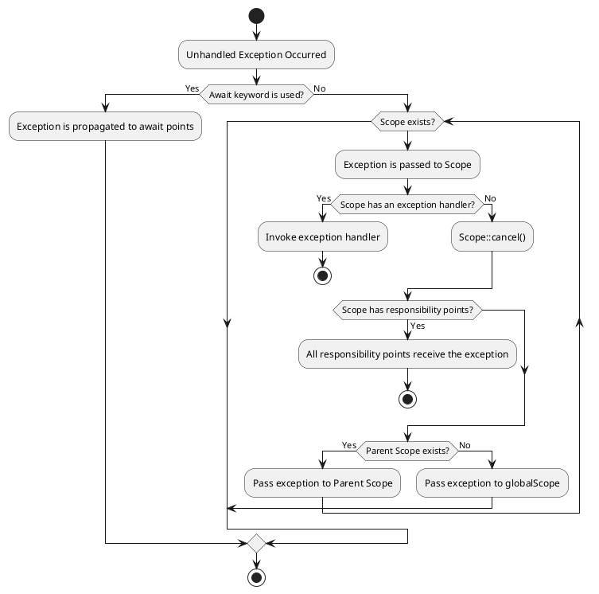
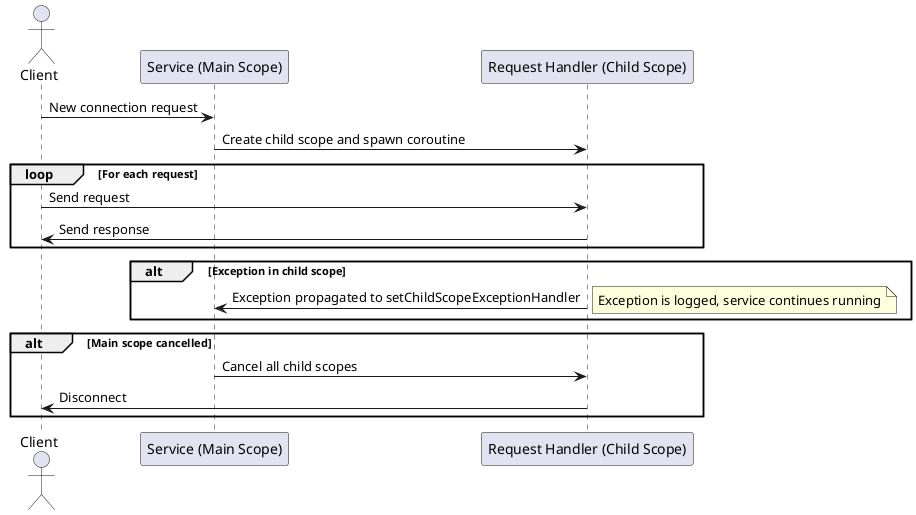

# PHP True Async

## Proposal

### Scheduler and Reactor

The **Scheduler** and **Reactor** components should be described in a separate **RFC**, 
which should focus on the low-level implementation in **C** and define **API** contracts for PHP extensions. 
These components should be developed as extensions that may be included 
in the PHP standard library but can also be replaced with custom implementations.

The **Scheduler** is a component responsible for managing the execution order of coroutines.  

> ⚠️ **Warning:** Users should not make assumptions about the execution order of coroutines unless 
> this is a specific goal of a particular **Scheduler** implementation.

The **Reactor** is a component that implements the **Event Loop**. 
It may be exposed as a separate API in **PHP-land**, 
but its behavior is not defined within this **RFC**.

> ⚠️ **Notice:** The logic of **Scheduler** and **Reactor** **MUST NOT** contradict the logic of this RFC!
> These components **MUST** implement the contracts defined in this document. 
> The **Scheduler** and **Reactor** **MAY** extend the behavior of this **RFC** by providing additional functionalities.

### Limitations

This **RFC** does not implement "colored functions" 
(see: https://journal.stuffwithstuff.com/2015/02/01/what-color-is-your-function/). 
Instead, it provides **transparent concurrency**, allowing **any function** to be asynchronous.

This **RFC** does not contradict a potential multitasking implementation 
where possible but does not assume its existence.

This **RFC** assumes the ability to create coroutines in other **Threads** using the **Scheduler API** 
or separate extensions but does not describe this capability.

This **RFC** also assumes functionality expansion using **SharedMemory**, 
specifically designed shared memory objects, through a separate API that is not part of this **RFC**.

This *RFC* is a core part of the **PHP TRUE ASYNC** contracts 
but assumes the development and approval of the following RFCs:

- **True Async API** – a low-level API for PHP extensions
- **Scheduler/Reactor API** – additional API for managing coroutines and the event loop
- **Primitives:** `Channel`, `Future`, `Iterator`, `Interval`
- **Inter-thread communication / Shared Memory objects**

### Namespace

All functions, classes, and constants defined in this **RFC** are located in the `Async` namespace.
Extensions for **Scheduler/Reactor** are allowed to extend this namespace with functions and classes, 
provided that they are directly related to concurrency functionality.

### Coroutine

> A `Coroutine` is an `execution container`, transparent to the code, 
> that can be suspended on demand and resumed at any time.

Isolated execution contexts make it possible to switch between coroutines and execute tasks concurrently.

Any function can be executed as a coroutine without any changes to the code.

A coroutine can stop itself bypassing control to the `Scheduler`. 
However, it cannot be stopped externally.

A suspended coroutine can be resumed at any time.
The `Scheduler` component is responsible for the coroutine resumption algorithm.

A coroutine can be resumed with an **exception**, in which case an exception 
will be thrown from the suspension point.

### Spawn

To create coroutines, the `spawn <callable>` expression is used. 
It launches the `<callable>` in a separate execution context and returns 
an instance of the `Async\Coroutine` class as a result.

Let's look at two examples:

```php
$result = file_get_contents('https://php.net');
echo "next line".__LINE__."\n";
```

This code first returns the contents of the PHP website, 
then executes the `echo` statement.

```php
$coroutine = spawn file_get_contents('https://php.net');
echo "next line".__LINE__."\n";
```

This code starts a coroutine with the `file_get_contents` function.
The next line is executed without waiting for the result of `file_get_contents`.

The `spawn` construct is available in two variations:
* `spawn function_call` - creates a coroutine from a callable expression
* `spawn closure_block` - creates a coroutine and defines a closure

```php
// Executing a known function
spawn [with <scope>] <function_call>;

// Closure form
spawn [with <scope>] [use(<parameters>)][: <returnType>] {
    <codeBlock>
};
```

*where:* 

`function_call` - a valid function call expression:

- call a standard PHP function

```php

spawn file_get_contents('file1.txt');
```

- call a user-defined function

```php
function example(string $name): void {
    echo "Hello, $name!";
}

spawn example('World');
```

- call a static method

```php
spawn Mailer::send($message);
```

- call a method of an object

```php
$object = new Mailer();
spawn $object->send($message);
```

- self, static or parent keyword:

```php
spawn self::send($message);
spawn static::send($message);
spawn parent::send($message);
```

- call `$class` method

```php
$className = 'Mailer';
spawn $className::send($message);
```

- expression

```php
// Use result of foo()
spawn (foo())();
// Use foo as a closure
spawn (foo(...))();
// Use ternary operator
spawn ($option ? foo() : bar())();
// Scary example
spawn (((foo())))();
```

- call array dereference

```php
$array = [fn() => sleep(1)];
spawn $array[0]();
```

- new dereference

```php
class Test {
    public function wait(): void {
        sleep(1);
    }
}

spawn new Test->wait();
```

- call dereferenceable scalar:

```php
spawn "sleep"(5);
```

- call short closure

```php
spawn (fn() => sleep(1))();
```

#### Spawn closure syntax

Allows creating a coroutine from a closure directly when using `spawn`:

```php
spawn [with <scope>] [use(<parameters>)[: <returnType>]] {
    <codeBlock>
};
```

- full form

```php
$file = 'main.log';

spawn use($file): string {
    $result = file_get_contents($file);
    
    if($result === false) {
        throw new Exception("Error reading $file");
    }
    
    return $result;
};
```

- short form

```php
spawn {
    return file_get_contents('main.log');
};
```

- with return type

```php
spawn use():string {
    return file_get_contents('main.log');
};
```

#### In scope expression

The `in` keyword allows specifying the scope in which the coroutine.

```php
$scope = new Async\Scope();

$coroutine = spawn in $scope use():string {
    return "Hello, World!";
};

function test(): string {
    return "Hello, World!";
}

spawn in $scope test();
```

The `scope` expression can be:
- A variable

```php
spawn in $scope function:void {
    echo "Hello, World!";
};
```

- The result of a method or function call

```php
spawn in $this->scope $this->method();
spawn in $this->getScope() $this->method();
```

### Suspension

A coroutine can suspend itself at any time using the `suspend` keyword:

```php
function example(string $name): void {
    echo "Hello, $name!";
    suspend;
    echo "Goodbye, $name!";
}

spawn example('World');
spawn example('Universe');
```

Expected output:

```
Hello, World!
Hello, Universe!
Goodbye, World!
Goodbye, Universe!
```

**Basic syntax:**

```php
    suspend;
```

**Wrong use:**

```php
    // not function
    suspend();
    // not part of the expression
    suspend + $any;
    // not parameter
    my_function(suspend);
```

The `suspend` keyword can be used only for the current coroutine.

The `suspend` keyword has no parameters and does not return any values, unlike the `yield` keyword.

The `suspend` keyword can be used in any function including from the **main execution flow**:

```php
function example(string $name): void {
    echo "Hello, $name!";
    suspend;
    echo "Goodbye, $name!";
}

$coroutine = spawn example('World');

// suspend the main flow
suspend;

echo "Back to the main flow";
```

Expected output:

```
Hello, World!
Back to the main flow
Goodbye, World!
```

The `suspend` keyword can be a throw point if someone resumes the coroutine externally with an exception.

```php
function example(string $name): void {
    echo "Hello, $name!";
    
    try {
        suspend;
    } catch (Exception $e) {
        echo "Caught exception: ", $e->getMessage();
    }
        
    echo "Goodbye, $name!";
}

$coroutine = spawn example('World');

// pass control to the coroutine
suspend;

$couroutine->cancel();
```

Expected output:

```
Hello, World!
Caught exception: cancelled at ...
Goodbye, World!
```

### Input/Output Operations And Implicit Suspension

I/O operations invoked within the coroutine's context transfer control implicitly:

```php
spawn function:void {
    echo "Start reading file1.txt\n";
    file_get_contents('file1.txt');
    echo "End reading file1.txt\n";
}
spawn function:void {
    echo "Start reading file2.txt\n";
    file_get_contents('file2.txt');
    echo "End readingfile2.txt\n";  
}

echo "Main flow";
```

Expected output:

```
Start reading file1.txt
Start reading file2.txt
Main flow
End reading file1.txt
End reading file2.txt
```

Inside each coroutine, 
there is an illusion that all actions are executed sequentially, 
while in reality, operations occur asynchronously.

### Awaitable interface

The `Awaitable` interface is a contract that allows objects to be used in the `await` expression.

The interface does not have any methods on the user-land side
and is intended for objects implemented as PHP extensions, such as:

- `Future`
- `Cancellation`

The following classes from this **RFC** also implement this interface:

- `Coroutine`
- `Scope`

### Await

The `await` keyword is used to wait for the completion of another coroutine:

```php
function readFile(string $fileName):string 
{
    $result = file_get_contents($fileName);
    
    if($result === false) {
        throw new Exception("Error reading file1.txt");
    }
    
    return $result;
}

$coroutine = spawn readFile('file1.txt');

echo await $coroutine;
// or
echo await spawn readFile('file2.txt');
```

`await` suspends the execution of the current coroutine until
the awaited one returns a final result or completes with an exception.

```php
function test(): void {
    throw new Exception("Error");
}

try {
    await test();
} catch (Exception $e) {
    echo "Caught exception: ", $e->getMessage();
}
```

**Await basic syntax:**

```php
    [<resultExp> = ] await <awaitExp>;
```

**where:**

- `resultExp` - An expression that will receive the result of the awaited operation.
- `awaitExp` - An expression whose result must be an object with the `Async\Awaitable` interface. 
- `cancellationExp` - An expression that limits the waiting time. 
Must be an object with the `Async\Awaitable` interface.

**Await expression:**

- A variable of the `Awaitable` interface

```php
    $readFileJob = spawn file_get_contents('file1.txt');
    
    $result = await $readFileJob;
```

- A function that returns an `Awaitable` object

```php
    function getContentsJobStarter(string $fileName): \Async\Coroutine {
        return spawn file_get_contents($fileName);
    }

    $result = await getContentsJobStarter('file1.txt');
```

- A new coroutine

```php
    $result = await spawn file_get_contents('file1.txt');
```

- A new Awaitable object

```php
    $result = await new Async\Future();
```

- A static method

```php
    $result = await SomeClass::create();
```

- A method of an object

```php
    $service = new Mailer();
    $result = await $service->sendMail("test@mail.com", "Hello!");
```

- A method of a class

```php
    $serviceClass = 'Mailer';
    $result = await $serviceClass::sendAll();
```

- A valid expression

```php
    $result = await ($bool ? foo() : bar());
```

#### Await with cancellation

##### Motivation

The wait operation is often combined with a `cancellation token`.  
In modern programming languages, the cancellation token is typically passed as 
an additional parameter to functions, 
which makes the semantics somewhat unclear.

For example:
```php
await all([...], $cancellation);
```

Clearer semantics would allow us to logically and visually separate the wait operation into two conditions:
1. What we're waiting for
2. How long we're willing to wait

For example:
```php
await all([...]) until $cancellation;
// or if timeout() returns a awaitable object
await all([...]) until timeout(5);
```

**basic syntax:**

```php
    [<resultExp> = ] await <awaitExp> [until <cancellationExp>];
```

**where:**

- A variable of the `Async\Awaitable` interface

```php
    $cancellation = new Future();
    $result = await $coroutine until $cancellation;
```

- A function that returns an `Awaitable` object

```php
    function getCancellation(): \Async\Awaitable {
        return spawn sleep(5);
    }

    $result = await $coroutine until getCancellation();
```

- A new coroutine

```php
    $result = await $coroutine until spawn sleep(5);
```

### Edge Behavior

The use of `spawn`/`await`/`suspend` is allowed in almost any part of a PHP program.
This is possible because the PHP script entry point forms the **main execution thread**, 
which is also considered a coroutine.  

As a result, keyword like `suspend` and `currentCoroutine()` will behave the same way as in other cases.

If only **one coroutine** exists in the system, calling `suspend` will immediately return control.

The `register_shutdown_function` handler operates in synchronous mode, 
after asynchronous handlers have already been destroyed. 
Therefore, the `register_shutdown_function` code should not use the concurrency API.
The `suspend` keyword will have no effect, and the `spawn` operation will not be executed at all.

### Scope and structured concurrency

**Structured concurrency** allows organizing coroutines into 
a group or hierarchy to manage their lifetime or exception handling.

The `Async\Scope` class enables grouping coroutines together, 
allowing to create a hierarchy of groups (i.e., a hierarchy of `Async\Scope`).

```php

use Async\Scope;

$scope = new Scope();

spawn in $scope {
    spawn {
        echo "Child of Task 1\n";
    };
    
    echo "Task 1\n";    
};

spawn in $scope {
    echo "Task 2\n";
};

await $scope->all();
```

**Expected output:**

```
Task 1
Task 2
Child of Task 1
```

In this example, **all three child coroutines** belong to the same `$scope`.

The coroutine with text `"Child of Task 1"` also belongs to `$scope`, 
meaning it is at the same level as the `"Task 1"` and `"Task 2"` coroutines.

If the `$scope` is destroyed, all associated coroutines will be reliably terminated along with it.
Therefore, the following code will not print anything.

```php

use Async\Scope;

$scope = new Scope();

spawn in $scope {
    spawn {
        echo "Child of Task 1\n";
    };
    
    echo "Task 1\n";    
};

spawn in $scope {
    echo "Task 2\n";
};

unset($scope);
```

**Expected output:**

```
```

This happens because the `Scope` object loses its last reference, 
triggering the destructor, which cancels the coroutines before they even get a chance to start.

This makes `Scope` objects a good (though not the best) tool for managing the lifetime of coroutines.  
For example, you can assign the `$scope` object to another object and explicitly control its lifetime:

```php
use Async\Scope;

class Service 
{
    private Scope $scope;
    
    public function __construct() {
        $this->scope = new Scope();
    }
    
    public function __destruct() {
        $this->scope->dispose();
    }
    
    public function run(): void {
        spawn in $this->scope {
            echo "Task 1\n";
        };
    }    
}
```

#### Point of Responsibility

The `spawn <callable>` expression allows you to create coroutines, 
but it says nothing about who "owns" the coroutines. 
This can become a source of errors, as resources are allocated without explicit management.

Scope helps solve this problem by implementing responsibility for coroutine ownership.

```php

function subtask() {
    
}

function task(): void
{
    spawn subtask();
}

$scope = new Scope();
spawn in $scope task();
```

```
main()                          ← defines a $scope and run task()
└── task()                      ← inherits $scope and run subtask()
    └── subtask()               ← inherits $scope
```

Once `$scope` is defined and a coroutine is created from it, 
`$scope` is inherited throughout the entire depth of function calls.

This way, a place in the code is created that can control the lifetime of coroutines, 
wait for their completion, handle exceptions, or cancel their execution.

Scope serves as a **point of responsibility** in managing coroutine resources.

#### Scope waiting

`Scope` can be useful both for waiting on coroutines and for limiting their lifetime.  
It works especially well when the waiting logic is used together with a `try`–`finally` block:

```
main()                          ← defines a request Scope and run handleRequest()
└── handleRequest()
    └── processUser()
        └── fetchProfile()      ← creates coroutine
        └── fetchSettings()     ← creates coroutine
```

Code that creates a `Scope` typically intends to control only the tasks it has **explicitly** defined,  
because it knows nothing about the coroutines created deeper in the call stack.

Let's say we have a function that creates an array of tasks performing some background work:

```php
function processAllUsers(string ...$users): array
{
    $coroutines = [];
    
    foreach ($users as $user) {
        $coroutines[] = spawn processUser($user);
    }
    
    return await all($coroutines);
}
```

The code `return await all($coroutines)` waits for the completion of all tasks 
that were explicitly started within this function.  
However, if the `processUser` function created other coroutines that, 
for some reason, continue to run after `processUser` has finished,  
there is a risk of a resource leak.

This problem has three solutions:

1. You can wait for all coroutines that were created within a single `Scope`.  
   In this case, there is a higher chance that all nested calls will eventually complete properly.  
   However, there's also a higher risk that more tasks will remain in a waiting state, which means more memory consumption.

2. You can wait only for the coroutines that are explicitly needed,  
   and cancel all others that were implicitly created in the current `Scope` with an error.  
   In this case, there will be no resource leaks.  
   However, there's a risk that an important coroutine might be mistakenly cancelled.

3. You can create a **point of responsibility**, a special place in the code where resource leak control will be performed.

Scope helps implement any of these strategies.

```php
function processAllUsers(string ...$users): array
{
    $scope = new Scope();
    
    foreach ($users as $user) {
        spawn in $scope processUser($user);
    }
    
    return await $scope->tasks();
}
```

In this example, the `processAllUsers` function must return the computation results of `processUser` for each user.  
`processAllUsers` has no knowledge of how `processUser` is implemented.  
Using `await $scope->tasks()`, `processAllUsers` waits for the results of all coroutines created 
inside the `foreach ($users as $user)` loop.

When the waiting completes, the `$scope` goes out, 
thereby cancelling any coroutines that continue running by mistake.

We can imagine another scenario.  
There is a Job Manager that launches various tasks.  
It has no idea what exactly each task might do.  
However, it must guarantee that no more than **X** tasks are running at the same time.

To achieve this, it needs to wait until all tasks have completed — regardless of whether some coroutines 
were mistakenly created or not — because for the Job Manager, 
**waiting is more important than forcefully destroying data**.

```php
function processBackgroundJobs(string ...$jobs): array
{
    $scope = new Scope();
    
    foreach ($jobs as $job) {
        spawn with $scope processJob($users);
    }
    
    await $scope->all();
}
```

You can use an additional constraint like `until timeout($value)` to limit the waiting time,  
or you can approach the problem a bit differently:

```php
function processBackgroundJobs(string ...$jobs): array
{
    $scope = new Scope();
    
    foreach ($jobs as $job) {
        spawn with $scope processJob($users);
    }
    
    await $scope->tasks();
    
    try {
        await $scope->all() until timeout(1);    
    } catch (CancellationException) {
       logWrongTasks($scope);
    }
    
    await $scope->all() until timeout(10000);
}
```

This demonstrates a soft cancellation strategy.  
First, the code waits for the main tasks to complete.  
Then, it waits for any remaining tasks. If there are any, a `CancellationException` is thrown,  
and the code logs information about which coroutines were not properly completed.  
After that, it waits for their completion again.

#### Scope cancellation

The `cancel` method cancels all child coroutines:

```php
$scope = new Scope();
$scope->spawn(function() {
    sleep(1);
    echo "Task 1\n";
});

$scope->spawn(function() {
    sleep(2);
    echo "Task 2\n";
});

$scope->cancel();
```

#### Scope Hierarchy

A hierarchy can be a convenient way to describe an application as a set of dependent tasks:
 
* Parent tasks are connected to child tasks and are responsible for their execution time.  
* Tasks on the same hierarchy level are independent of each other.  
* Parent tasks should control their child tasks.  
* Child tasks MUST NOT control or wait for their parent tasks.  
* It is correct if tasks at the same hierarchy level are only connected to tasks of the immediate child level.

```
WebServer  
├── Request Worker  
│   ├── request1 task
│   │   ├── request1 subtask A  
│   │   └── request1 subtask B  
│   └── request2 task  
│       ├── request2 subtask A  
│       └── request2 subtask B  
```

The work of a web server can be represented as a hierarchy of task groups that are interconnected.  
The `Request Worker` is a task responsible for handling incoming requests. There can be multiple requests.  
Each request may spawn subtasks. On the same level, all requests form a group of request-tasks.

`Scope` is fit for implementing this concept:

```
WebServer  
├── Request Worker  
│   ├── request1 Scope  
│   │   ├── request1 subtask A  
│   │   │   └── subtask A Scope  
│   │   │       ├── sub-subtask A1  
│   │   │       └── sub-subtask A2  
│   │   └── request1 subtask B  
│   └── request2 Scope  
│       ├── request2 subtask A  
│       └── request2 subtask B  
│           └── subtask B Scope  
│               └── sub-subtask B1  
```

A new child `Scope` can be created using a special constructor:  
`Scope::inherit()`.  
It returns a new `Scope` object that acts as a child.  
A coroutine created within the child `Scope` can also be considered a child relative to the coroutines in the parent `Scope`.

The advantage of a child scope is that it’s not “floating” — it’s attached to its parent.  
The code that creates a child `Scope` doesn't need to know the intentions of the code that created the parent, except for one thing:  
all tasks within the child `Scope` cannot outlive the parent `Scope`.  
This means the tasks must be logically connected in such a way that if the parent is cancelled, it makes sense to cancel all of its descendants too.

Let’s look at an example.

```php
use Async\Scope;
use Async\CancellationException;

function connectionChecker($socket, callable $cancelToken): void
{
    while (true) {
        if(feof($socket)) {
            $cancelToken("The connection was closed by user");
            return;
        }                               
        
        sleep(1);
    }
}

function connectionLimiter(callable $cancelToken): void
{
   sleep(10);
   $cancelToken("The request processing limit has been reached.");   
}

function connectionHandler($socket): void
{
    $scope = Scope::inherit();

    spawn in $scope use($socket, $scope) {

        $cancelToken = fn(string $message) => $scope->cancel(new CancellationException($message));        

        // Limiter coroutine
        spawn connectionLimiter($cancelToken);
        
        // A separate coroutine checks that the socket is still active.    
        spawn connectionChecker($socket, $cancelToken);
    
        try {
            sendResponse($socket, dispatchRequest(parseRequest($socket)));
        } catch (Throwable $exception) {
            fwrite($socket, "HTTP/1.1 500 Internal Server Error\r\n\r\n");
        } finally {
            fclose($socket);
            $scope->cancel();
        }
    };
}

function socketListen(): void
{
    $scope = new Scope();

    // Child coroutine that listens for a shutdown signal
    spawn in $scope use($scope) {
        await Async\signal(SIGINT);
        $scope->cancel(new CancellationException("Server shutdown"));
    }

    try {
       // Main coroutine that listens for incoming connections
       await spawn in $scope {
           while ($socket = stream_socket_accept($serverSocket, 0)) {            
               connectionHandler($socket);
           }
       };    
    } catch (\Throwable $exception) {
        echo "Server error: ", $exception->getMessage(), "\n";
    } finally {
        echo "Server should be stopped...\n";
        
        // Graceful exit
        try {
            $scope->cancel();
            await $scope->all() until Async\timeout(5);
            echo "Server stopped\n";
        } catch (\Throwable $exception) {
            // Force exit
            echo "Server error: ", $exception->getMessage(), "\n";
            throw $exception;
        }
    }
}
```
Let's examine how this example works.

1. `socketListen` creates a new Scope for coroutines that will handle all connections.
2. Each new connection is processed using `connectionHandler()` in a separate Scope, which is inherited from the main one.
3. `connectionHandler` creates two coroutines: `connectionLimiter()` and `connectionChecker()`.
4. `connectionHandler` creates another coroutine, `connectionChecker()`, to monitor the connection's activity. 
As soon as the client disconnects, `connectionChecker` will cancel all coroutines related to the request.
5. If the main Scope is closed, all coroutines handling requests will also be canceled.

```
GLOBAL <- globalScope
│
├── socketListen (Scope) <- rootScope
│   │
│   ├── connectionHandler (Scope) <- request scope1
│   │   └── connectionLimiter (Coroutine)
│   │   └── connectionChecker (Coroutine)
│   │
│   ├── connectionHandler (Scope) <- request scope2
│   │   └── connectionLimiter (Coroutine)
│   │   └── connectionChecker (Coroutine)
│   │
```

The `connectionHandler` doesn't worry if the lifetimes of the `connectionLimiter` or `connectionChecker`
coroutines exceed the lifetime of the main coroutine handling the request, 
because it is guaranteed to call `$scope->cancel()` when the main coroutine finishes.

On the other hand, if the server receives a shutdown signal, 
all child `Scopes` will be cancelled because the main `Scope` will be cancelled as well.

Note that the coroutine waiting on `await Async\signal(SIGINT)` will not remain hanging in memory 
if the server shuts down in another way, because `$scope` will be explicitly closed in the `finally` block.

### Async blocks

The `async` block allows you to create a code section in which the `$scope` is explicitly created and explicitly disposed. 
The following is a code example:

```php
$scope = new Scope();

try {
   await spawn in $scope {
       echo "Task 1\n";
   };
} finally {
    $scope->dispose();
}
```

Can be written using an `async` block as follows:

```php
async $scope {
   await spawn {
       echo "Task 1\n";
   };
}
```

The `async` block does the following:

1. It creates a new `Scope` object and assigns it to the variable specified at the beginning of the block as `$scope`.
2. All coroutines will, by default, be created within `$scope`. 
That is, expressions like `spawn <callable>` will be equivalent to `spawn in $scope <callable>`.
3. `async` ensures that once the block is exited, the created `Scope` will be explicitly released 
using the `dispose()` method, which means all coroutines created inside the block's `Scope` will be cancelled.

#### Motivation

The `async` block allows for describing groups of coroutines in a clearer 
and safer way than manually using `Async\Scope`.

Consider the following code:

```php
function generateReport(): void
{
    $scope = Scope::inherit();

    try {
        [$employees, $salaries, $workHours] = await Async\all([
            spawn in $scope fetchEmployees(),
            spawn in $scope fetchSalaries(),
            spawn in $scope fetchWorkHours()
        ]);

        foreach ($employees as $id => $employee) {
            $salary = $salaries[$id] ?? 'N/A';
            $hours = $workHours[$id] ?? 'N/A';
            echo "{$employee['name']}: salary = $salary, hours = $hours\n";
        }

    } catch (Exception $e) {
        echo "Failed to generate report: ", $e->getMessage(), "\n";
    } finally {
        $scope->dispose();
    }
}
```

The `async` statement allows you to group coroutines together and explicitly limiting the lifetime of the `Scope`:

```php
function generateReport(): void
{
    try {
        async inherit $scope {
            [$employees, $salaries, $workHours] = await Async\all([
                spawn fetchEmployees(),
                spawn fetchSalaries(),
                spawn fetchWorkHours()
            ]);
    
            foreach ($employees as $id => $employee) {
                $salary = $salaries[$id] ?? 'N/A';
                $hours = $workHours[$id] ?? 'N/A';
                echo "{$employee['name']}: salary = $salary, hours = $hours\n";
            }        
        }
        
    } catch (Exception $e) {
        echo "Failed to generate report: ", $e->getMessage(), "\n";
    }
}

```

Using an `async` block makes it easier to describe a pattern 
where a group of coroutines is created with one main coroutine and several secondary ones.  
As soon as the main coroutine completes, all the secondary coroutines will be terminated along with it.

```php
function startServer(): void
{
    async $serverSupervisor {
    
      // Secondary coroutine that listens for a shutdown signal
      spawn use($serverSupervisor) {
         await Async\signal(SIGINT);
         $serverSupervisor->cancel(new CancellationException("Server shutdown"));
      }    
    
      // Main coroutine that listens for incoming connections
      await spawn {
            while ($socket = stream_socket_accept($serverSocket, 0)) {            
                connectionHandler($socket);
            }
        };
    }
}
```

In this example, the server runs until `stream_socket_accept` returns `false`, or until the user presses **CTRL-C**.

#### async syntax

```php
async [inherit] [<scope>] {
    <codeBlock>
}
```

**where:**

- `scope` - a variable that will hold the `Async\Scope` object.

options:

```php
// variable
async $scope {}
```

wrong use:

```php
// array element
async $scope[0] {}
async $$scope {}
// object property
async $object->scope {}
async Object::$scope {}
// function call
async getScope() {}
// The nullsafe operator is not allowed.  
async $object?->scope
// Using references is not allowed.
async &$object
```

- `inherit` - a keyword that allows inheriting the parent `Scope` object.

- `codeBlock` - a block of code that will be executed in the `Scope` context.

### Error detection

Detecting erroneous situations when using coroutines is an important part of analyzing an application's reliability.

The following scenarios are considered potentially erroneous:

1. A coroutine belongs to a global scope and is not awaited by anyone (a **detached coroutine**).
2. The root scope has been destroyed (its destructor was called), but no one awaited 
it or ensured that its resources were explicitly cleaned up (e.g., by calling `$scope->cancel()` or `$scope->dispose()`).
3. Tasks were not cancelled using the `cancel()` method, but through a call to `dispose()`.  
This indicates that the programmer did not intend to cancel the execution of the coroutine,  
yet it happened because the scope was destroyed.
4. Deadlocks caused by circular dependencies between coroutines.

**PHP** will respond to such situations by issuing **warnings**, including debug information about the involved coroutines.  
Developers are expected to write code in a way that avoids triggering these warnings.

### Context

#### Motivation

Libraries and frameworks often use variables that are shared within a request to store common data. 
These variables are not **Global** in the general sense, 
but they essentially reflect a shared state related to the request or execution scope.

For example, the `TokenStorage` class 
(https://github.com/symfony/symfony/blob/7.3/src/Symfony/Component/Security/Core/Authentication/Token/Storage/TokenStorage.php) 
from `Symfony` allows retrieving the user token multiple times, as it is stored in a variable.

Or `/src/Illuminate/Auth/TokenGuard.php` from `Laravel`:

```php
    /**
     * Get the currently authenticated user.
     */
    public function user()
    {
        // If we've already retrieved the user for the current request we can just
        // return it back immediately. We do not want to fetch the user data on
        // every call to this method because that would be tremendously slow.
        if (! is_null($this->user)) {
            return $this->user; // <-- Shared state
        }

        $user = null;

        $token = $this->getTokenForRequest();
        
        // some code skipped

        return $this->user = $user;
    }
```

This code assumes that a single `process`/`thread` always handles only one request at a time. 
However, in a concurrent web server environment, 
shared states can no longer be used because the execution context may switch unexpectedly.

You can use `Coroutine ID` and `Map` to associate a unique coroutine ID with specific data. 
However, in this case, you must ensure that the data is properly released 
when the coroutine ceases to exist.

In addition to storing request-specific data, 
concurrent code must also ensure the proper handling of input/output descriptors. 
For example, when implementing a protocol, data must be sent in a specific sequence. 
If a socket is used by two coroutines simultaneously for reading/writing, 
the order of operations may be disrupted.

Another example is database transactions. 
Code that starts a transaction cannot release the database connection socket until 
the transaction is completed.

The `Async\Context` class is designed to help solve these issues.

#### Context API

The `Async\Context` class defines three groups of methods:
* Methods for retrieving values from the Map, considering parent contexts
* Methods for retrieving values only from the current context
* Methods for modifying or removing keys in the current context

| Method                                                                | Description                                             |
|-----------------------------------------------------------------------|---------------------------------------------------------|
| `find(string\|object $key): mixed`                                    | Find a value by key in the current or parent Context.   |
| `get(string\|object $key): mixed`                                     | Get a value by key in the current Context.              |
| `has(string\|object $key): bool`                                      | Check if a key exists in the current Context.           |
| `findLocal(string\|object $key): mixed`                               | Find a value by key only in the local Context.          |
| `getLocal(string\|object $key): mixed`                                | Get a value by key only in the local Context.           |
| `hasLocal(string\|object $key): bool`                                 | Check if a key exists in the local Context.             |
| `set(string\|object $key, mixed $value, bool $replace = false): self` | Set a value by key in the Context.                      |
| `unset(string\|object $key): self`                                    | Delete a value by key from the Context.                 |


**Context Slots** are an efficient mechanism for managing memory 
associated with `Scope` or coroutine lifetimes.  
Once all coroutines owning the Scope complete, 
or the Scope itself is terminated, all data in the slots will be released.

This helps the programmer associate data with coroutines without writing explicit cleanup code.

To ensure data encapsulation between different components, 
**Coroutine Scope Slots** provide the ability to associate data using **key objects**.  
An object instance is unique across the entire application, 
so code that does not have access to the object cannot read the data associated with it.

This pattern is used in many programming languages and is represented in JavaScript by a special class, **Symbol**.

```php
$key = 'pdo connection';

if(currentContext()->has($key)) {
    $pdo = currentContext()->get($key);
} else {
    $pdo = new PDO('sqlite::memory:');
    currentContext()->set($key, new PDO('sqlite::memory:'));
}
```

**Coroutine Scope Slots** can automatically dereference **WeakReference**.  
If you assign a **WeakReference** to a slot and then call `find()`, 
you will receive the original object or `NULL`.

```php
function task(): void 
{
    // Should return the original object
    $pdo = currentContext()->find('pdo');
}

$pdo = new PDO('sqlite::memory:');
currentContext()->set('pdo', new WeakReference($pdo));

spawn task();
```

#### Context inheritance

The context belongs to the `Scope` and is created along with it.  
If a `Scope` is inherited from a parent, the new context also inherits the parent.  
Thus, the hierarchy of Scope objects forms exactly the same hierarchy of contexts.

```php

use Async\Scope;
use function \Async\currentContext;
use function \Async\rootContext;

function handleRequest($socket): void
{
    echo currentContext()->get('request_id')."\n"; // <-- From request context
    echo currentContext()->get('server_id')."\n"; // <-- From server context
    echo rootContext()->get('request_id')."\n"; // <-- Should be NULL
}

function startRequestHandler($socket): void
{
    $requestScope = Scope::inherit(); // <-- Inherit server context
    $requestScope->context->set('request_id', uniqid()); // <-- Override server context slot
    
    // Handle request in separate coroutine and scope
    spawn in $requestScope handleRequest($socket);
}

function startServer(): void
{
    $serverScope = new Scope();
    $serverScope->context->set('server_id', uniqid());
    $serverScope->context->set('request_id', null);
    
    while (true) {
        $socket = stream_socket_accept($serverSocket, 0);
        startRequestHandler($socket);
    }    
}
```

The special functions `Async\currentContext()` and `Async\rootContext()` help
quickly access the current context from any function.

`Async\rootContext()` returns the context at the very root of the hierarchy,
if it exists, or the global application context if it does not.

#### Coroutine local context

While a `Scope` can serve as a shared context in the coroutine hierarchy, 
a coroutine's **local context** is a personal data store strictly tied to the coroutine's lifetime. 
The local context allows associating data slots that are automatically freed once the coroutine completes.

The local coroutine context is accessible via the `Async\coroutineContext()` function, 
which returns an `Async\Context` object. 
The `Async\Context` class provides the same methods for working with slots as the `Scope` class:

```php
function task(): void 
{
    coroutineContext()->set('data', 'This local data');
    
    spawn function() {
         // No data will be found
         echo coroutineContext()->find('data')."\n";
    };
}
```

Using a coroutine's local context can be useful for associating objects with a coroutine that **MUST** be unique to each coroutine.  
For example, a database connection.

```php
<?php

namespace Async;

use PDO;
use RuntimeException;

class ConnectionProxy
{
    private PDO $connection;

    public function __construct(PDO $connection)
    {
        $this->connection = $connection;
    }
    
    public function __destruct()
    {
        getGlobalConnectionPool()->releaseConnection($this->connection);
    }
}

class ConnectionPool
{
    private array $pool = [];
    private int $maxConnections = 10;

    public function getConnection(): ConnectionProxy
    {
        if (!empty($this->pool)) {
            return new ConnectionProxy(array_pop($this->pool));
        }

        if (count($this->pool) < $this->maxConnections) {
            return new ConnectionProxy(PDO("mysql:host=localhost;dbname=test", "user", "password"));
        }

        throw new RuntimeException("No available database connections.");
    }

    public function releaseConnection(PDO $connection): void
    {
        $this->pool[] = $connection;
    }
}

function getDb(): ConnectionProxy
{
    static $key = new Key('db_connection');
    
    $context = Async\coroutineContext();

    if ($context->has($key)) {
        return $context->get($key);
    }

    $pool = getGlobalConnectionPool();
    $connection = $pool->getConnection();

    $context->set($key, $connection);

    return $connection;
}

function getGlobalConnectionPool(): ConnectionPool
{
    static $pool = null;
    if ($pool === null) {
        $pool = new ConnectionPool();
    }
    return $pool;
}

function printUser(int $id): void 
{
    $db = getDb();
    $stmt = $db->query("SELECT * FROM users WHERE id = $id");
    $users = $stmt->fetchAll(PDO::FETCH_ASSOC);
    print_r($users);
}

spawn printUser(1);
spawn printUser(2);
```

This code relies on the fact that an instance of the `ConnectionProxy` 
class will be destroyed as soon as the coroutine completes.  
The destructor will be called, and the connection will automatically return to the pool.

### Error Handling

An uncaught exception in a coroutine follows this flow:

1. If the coroutine is awaited using the `await` keyword, 
the exception is propagated to the awaiting points. 
If multiple points are awaiting, each will receive the same exception
(**Each await point will receive the exact same exception object, not cloned**).
2. The exception is passed to the `Scope`.
3. If the `Scope` has an exception handler defined, it will be invoked.
4. If the `Scope` does not have an exception handler, the `cancel()` method is called, 
canceling all coroutines in this scope from top to bottom in the hierarchy, including all child scopes.
5. If the `Scope` has responsibility points, i.e., the construction `await $scope`, 
all responsibility points receive the exception.
6. Otherwise, the exception is passed to the parent scope if it is defined.
7. If there is no parent scope, the exception falls into `globalScope`, 
where the same rules apply as for a regular scope.



**Example:**

```php
use Async\Scope;

$scope = new Scope();

spawn in $scope {
    throw new Exception("Task 1");
};

$exception1 = null;
$exception2 = null;

$scope2 = new Scope();

spawn in $scope2 use($scope, &$exception1) {
    try {
        await $scope;
    } catch (Exception $e) {
        $exception1 = $e;
        echo "Caught exception1: {$e->getMessage()}\n";
    }
};

spawn in $scope2 use($scope, &$exception2) {
    try {
        await $scope;
    } catch (Exception $e) {
        $exception2 = $e;
        echo "Caught exception2: {$e->getMessage()}\n";
    }
};

await $scope2->tasks();

echo $exception1 === $exception2 ? "The same exception\n" : "Different exceptions\n";
```

If an exception reaches `globalScope` and is not handled in any way, 
it triggers **Graceful Shutdown Mode**, which will terminate the entire application.

The `Scope` class allows defining an exception handler that can prevent exception propagation.

For this purpose, two methods are used:
- **`setExceptionHandler`** – triggers for any exceptions thrown within this **Scope**.
- **`setChildScopeExceptionHandler`** – triggers for exceptions from **child Scopes**.

**Example:**

```php
$scope = new Scope();
$scope->setExceptionHandler(function (Async\Scope $scope, Async\Coroutine $coroutine, Throwable $e) {
    echo "Caught exception: {$e->getMessage()}\n in coroutine: {$coroutine->getSpawnLocation()}\n";
});

$scope->spawn(function() {
    throw new Exception("Task 1");
});

Async\await($scope);
```

Using these handlers, 
you can implement the **Supervisor** pattern, i.e., 
a **Scope** that will not be canceled when an exception occurs in coroutines.

The **`setChildScopeExceptionHandler`** method allows handling exceptions only from **child Scopes**, 
which can be useful for implementing an algorithm where the **main Scope** runs core tasks, 
while **child Scopes** handle additional ones.

For example:

```php

use Async\Scope;
use Async\Coroutine;

final class Service
{
    private Scope $scope;
    
    public function __construct()
    {
        $this->scope = new Scope();
        
        $this->scope->setChildScopeExceptionHandler(
        static function (Scope $scope, Coroutine $coroutine, \Throwable $exception): void {
            echo "Occurred an exception: {$exception->getMessage()} in Coroutine {$coroutine->getSpawnLocation()}\n";
        });
    }
    
    public function start(): void
    {
        spawn in $this->scope $this->run();
    }
    
    public function stop(): void 
    {
        $this->scope->cancel();
    }
    
    private function run(): void
    {
        while (($socket = $this->service->receive()) !== null) {
            spawn in Scope::inherit($this->scope) $this->handleRequest($socket);
        }
    }
}
```

`$this->scope` listens for new connections on the server socket.  
Canceling `$this->scope` means shutting down the entire service.

Each new connection is handled in a separate **Scope**, which is inherited from `$this->scope`.  
If an exception occurs in a coroutine created within a **child Scope**, 
it will be passed to the `setChildScopeExceptionHandler` handler and will not affect 
the operation of the service as a whole.



#### Responsibility points

A **responsibility point** is code that explicitly waits for the completion of a coroutine or a `Scope`:

```php
$scope = new Scope();

$scope->spawn(function() {
  throw new Exception("Task 1");        
});

try {
    await $scope;
} catch (\Throwable $e) {
     echo "Caught exception: {$e->getMessage()}\n";
}      
```

A **responsibility point** has a chance to receive 
not only the result of the coroutine execution but also an unhandled exception.

#### Exception Handling

The `Scope` class provides a method for handling exceptions:

```php
$scope = new Scope();

spawn in $scope {
    throw new Exception("Task 1");
};

$scope->setExceptionHandler(function (Exception $e) {
    echo "Caught exception: {$e->getMessage()}\n";
});

await $scope;
```

An exception handler has the right to suppress the exception.  
However, if the exception handler throws another exception, 
the exception propagation algorithm will continue.

#### onCompletion

The `onCompletion` method allows defining a callback function that will be invoked when a coroutine or scope completes.  
This method can be considered a direct analog of `defer` in Go.

```php
$scope = new Scope();

spawn in $scope {
    throw new Exception("Task 1");
};

$scope->onCompletion(function () {
    echo "Task 1 completed\n";
});

await $scope;
```

Or for coroutines:

```php
function task(): void 
{
    throw new Exception("Task 1");
}

$coroutine = spawn task();

$coroutine->onCompletion(function () {
    echo "Task completed\n";
});

```

The `onCompletion` semantics are most commonly used to release resources, 
serving as a shorter alternative to `try-finally` blocks:

```php
function task(): void 
{
    $file = fopen('file.txt', 'r');    
    onCompletion(fn() => fclose($file));
    
    throw new Exception("Task 1");
}

spawn task();
```

### Cancellation

The cancellation operation is available for coroutines and scopes 
using the `cancel()` method:

```php
function task(): void {}

$coroutine = spawn task();

// cancel the coroutine
$coroutine->cancel(new Async\CancellationException('Task was cancelled'));
```

The cancellation operation is implemented as follows:

1. If a coroutine has not started, it will never start.
2. If a coroutine is suspended, its execution will resume with an exception.
3. If a coroutine has already completed, nothing happens.

The `CancellationException`, if unhandled within a coroutine, is automatically suppressed after the coroutine completes.

> ⚠️ **Warning:** You should not attempt to suppress `CancellationException` exception, 
> as it may cause application malfunctions.

```php
$scope = new Scope();

spawn in $scope {
    sleep(1);        
    echo "Task 1\n";
};

$scope->cancel(new Async\CancellationException('Task was cancelled'));
```

Canceling a `Scope` triggers the cancellation of all coroutines 
within that `Scope` and all child `Scopes` in hierarchical order.

>
> **Note:** `CancellationException` can be extended by the user 
> to add metadata that can be used for debugging purposes.
> 

#### CancellationException propagation

The `CancellationException` affects PHP standard library functions differently. 
If it is thrown inside one of these functions that previously did not throw exceptions, 
the PHP function will terminate with an error.

In other words, the `cancel()` mechanism does not alter the existing function contract. 
PHP standard library functions behave as if the operation had failed.

Additionally, the `CancellationException` will not appear in `get_last_error()`, 
but it may trigger an `E_WARNING` to maintain compatibility with expected behavior 
for functions like `fwrite` (if such behavior is specified in the documentation).

#### exit and die keywords

The `exit`/`die` keywords called within a coroutine result in the immediate termination of the application.  
Unlike the `cancel()` operation, they do not allow for proper resource cleanup.

### Graceful Shutdown

When an **unhandled exception** occurs in a **Coroutine**
the **Graceful Shutdown** mode is initiated. 
Its goal is to safely terminate the application.

**Graceful Shutdown** cancels all coroutines in `globalScope`, 
then continues execution without restrictions, allowing the application to shut down naturally.  
**Graceful Shutdown** does not prevent the creation of new coroutines or close connection descriptors. 
However, if another unhandled exception is thrown during the **Graceful Shutdown** process, 
the second phase is triggered.

**Second Phase of Graceful Shutdown**
- All **Event Loop descriptors** are closed.
- All **timers** are destroyed.
- Any remaining coroutines that were not yet canceled will be **forcibly canceled**.

The further shutdown logic may depend on the specific implementation of the **Scheduler** component, 
which can be an external system and is beyond the scope of this **RFC**.

The **Graceful Shutdown** mode can also be triggered using the function:

```php
Async\gracefulShutdown(\Throwable|null $throwable = null): void {}
```

from anywhere in the application.

### Deadlocks

A situation may arise where there are no active **Coroutines** in the execution queue 
and no active handlers in the event loop. 
This condition is called a **Deadlock**, and it represents a serious logical error.

When a **Deadlock** is detected, the application enters **Graceful Shutdown** mode 
and generates warnings containing information about which **Coroutines** are in a waiting state 
and the exact lines of code where they were suspended.

### Tools

The `Coroutine` class implements methods for inspecting the state of a coroutine.

| Method                                 | Description                                                                                                                                                                                            |
|----------------------------------------|--------------------------------------------------------------------------------------------------------------------------------------------------------------------------------------------------------|
| **`getSpawnFileAndLine():array`**      | Returns an array of two elements: the file name and the line number where the coroutine was spawned.                                                                                                   |
| **`getSpawnLocation():string`**        | Returns a string representation of the location where the coroutine was spawned, typically in the format `"file:line"`.                                                                                |
| **`getSuspendFileAndLine():array`**    | Returns an array of two elements: the file name and the line number where the coroutine was last suspended. If the coroutine has not been suspended, it may return `['',0]`.                           |
| **`getSuspendLocation():string`**      | Returns a string representation of the location where the coroutine was last suspended, typically in the format `"file:line"`. If the coroutine has not been suspended, it may return an empty string. |
| **`isSuspended():bool`**               | Returns `true` if the coroutine has been suspended                                                                                                                                                     |
| **`isCancelled():bool`**               | Returns `true` if the coroutine has been cancelled, otherwise `false`.                                                                                                                                 |
| **`getTrace():array`**                 | Returns the stack trace of the coroutine.                                                                                                                                                              |

The `Coroutine::getAwaitingInfo()` method returns an array with debugging information 
about what the coroutine is waiting for, if it is in a waiting state.

The format of this array depends on the implementation of the **Scheduler** and the **Reactor**.

The `Async\getCoroutines()` method returns an array of all coroutines in the application.

### Prototypes

* [Async functions](./examples/Async/Async.php)
* [Coroutine](./examples/Async/Coroutine.php)
* [Coroutine Context](./examples/Async/Context.php)
* [Coroutine Scope](./examples/Async/Scope.php)

## Backward Incompatible Changes

Simultaneous use of the **True Async API** and the **Fiber API** is not possible.

- If `new Fiber()` is called first, the `Async\spawn` function will fail with an error.
- If `Async\spawn` is called first, any attempt to create a **Fiber** will result in an error.

## Proposed PHP Version(s)

PHP 8.6/ PHP 9.0