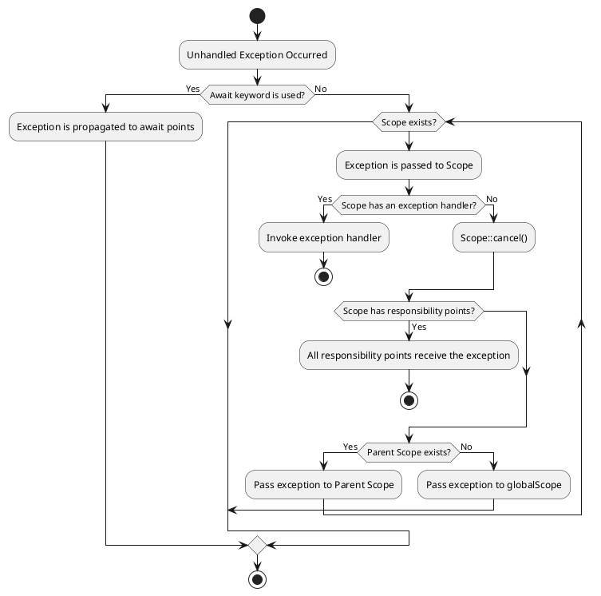
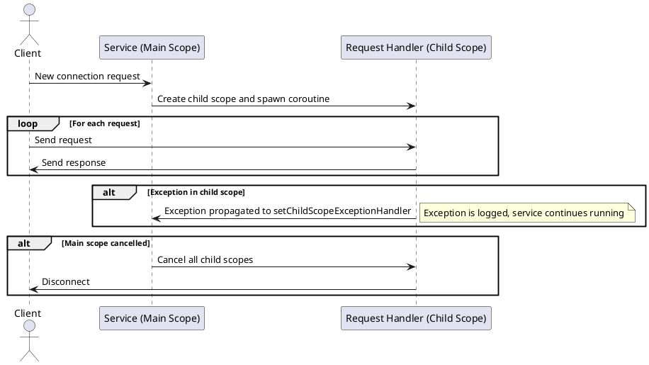

# PHP True Async

## Proposal

### 📚 Diagrams Overview

This **RFC** is quite complex due to the number of logical connections.
Please use the diagrams from the table to simplify understanding.

| Diagram Name                                                  | Description                                                                                  |
|---------------------------------------------------------------|----------------------------------------------------------------------------------------------|
| [mind-map](diagrams/mind-map.svg)                             | A mind map showing the relationship between key features and problems solved by the **RFC**. |
| [feature-to-requirement](diagrams/feature-to-requirement.svg) | Maps features to the requirements that generated them.                                       |
| [decision-tree](diagrams/decision-tree.svg)                   | A decision tree that guides developers on which API to use depending on the situation.       |

### Overview

This **RFC** describes the **API** and **new syntax** for writing concurrent code in PHP, which includes:

#### Launching any function in non-blocking mode:

```php 
function myFunction(): void 
{
    echo "Hello, World!\n";
}

spawn myFunction();
sleep(1);
echo "Next line\n";
```

Output:

```
Hello, World!
Next line
```

#### Non-blocking versions of built-in PHP functions:
```php
spawn {
    $result = file_get_contents("file.txt");
    
    if($result === false) {
        echo "Error reading file.txt\n";
    }
    
    echo "File content: $result\n";
};

echo "Next line\n";
```

Output:

```
Next line
File content: ...
```

#### Waiting for coroutine results

```php
function fetchData(string $file): string
{
    $result = file_get_contents($file);
    
    if($result === false) {
        throw new Exception("Error reading $file");
    }
    
    return $result;    
}
echo await spawn fetchData("file.txt");
```

#### Awaiting a result with cancellation

```php
echo await spawn fetchData("https://php.net/") until spawn sleep(2);
```

#### Suspend keyword

Transferring control from the coroutine to the `Scheduler`:

```php
function myFunction(): void {
    echo "Hello, World!\n";
    suspend;
    echo "Goodbye, World!\n";
}

spawn myFunction();
echo "Next line\n";
```

Output:

```
Hello, World
Next line
Goodbye, World
```

#### Working with a group of concurrent tasks.

```php
function mergeFiles(string ...$files): string
{
    $scope = new Async\Scope();
    $taskGroup = new Async\TaskGroup(scope: $scope, captureResults: true);
    
    foreach ($files as $file) {
       $taskGroup->spawn(file_get_contents(...), $file);
    }
    
    return array_merge("\n", await $taskGroup);
}
```

#### Structured concurrency

```php
function loadDashboardData(string $userId): array
{
    $scope = new Async\Scope();
    $taskGroup = new Async\TaskGroup($scope, captureResults: true);

    spawn with $taskGroup fetchUserProfile($userId);
    spawn with $taskGroup fetchUserNotifications($userId);
    spawn with $taskGroup fetchRecentActivity($userId);
    
    try {
        await $scope;
        
        [$profile, $notifications, $activity] = $taskGroup->getResults();
        
        return [
            'profile' => $profile,
            'notifications' => $notifications,
            'activity' => $activity,
        ];
    } catch (\Exception $e) {
        logError("Dashboard loading failed", $e);
        return ['error' => $e->getMessage()];
    }
}

function fetchUserSettings(string $userId): array 
{
    // ...
    // This exception stops all tasks in the hierarchy that were created as part of the request.
    throw new Exception("Error fetching customers");
}

function fetchUserProfile(string $userId): array 
{
    $userDataScope = new Async\Scope();
    $taskGroup = new Async\TaskGroup($userDataScope, captureResults: true);
    
    $taskGroup->add(spawn fetchUserData());
    $taskGroup->add(spawn fetchUserSettings($userId));

    await $userDataScope;
    
    [$userData, $settings] = $taskGroup->getResults();
    
    $userData['settings'] = $settings ?? [];
    
    return $userData;
}

spawn loadDashboardData($userId);
```

```text
loadDashboardData()  ← async $dashboardScope
├── fetchUserProfile()  ← async inherit $userDataScope
│   ├── spawn fetchUserData()
│   └── spawn fetchUserSettings()
│       ├── throw new Exception(...) ← ❗can stop all tasks in the hierarchy
├── spawn fetchUserNotifications()
└── spawn fetchRecentActivity()
```

#### Await all child tasks.

```php
function processBackgroundJobs(string ...$jobs): array
{
    $scope = new Scope();
    
    foreach ($jobs as $job) {
        spawn with $scope processJob($job);
    }
    
    // Waiting for all child tasks throughout the entire depth of the hierarchy.
    await $scope;
}

function processJob(mixed $job): void {
    $scope = \Async\Scope::inherit();
    spawn $scope task1($job);
    spawn $scope task2($job);
    
    // Waiting for all child tasks in the current scope.
    await $scope;
}
```

### Scheduler and Reactor

**Scheduler** and **Reactor** must be implemented as `PHP` extensions that implement low-level interfaces.

The **Scheduler** and **Reactor** interfaces are part of the implementation of this **RFC**.

The behavior of **Scheduler** and **Reactor** must not contradict the logic of the **RFC**.
Components cannot override the logic of expressions such as spawn, async, suspend, and so on.
However, this **RFC** does not impose any restrictions on extending functionality.

It is allowed to use the **Async** namespace for new functions or objects in **Scheduler** and **Reactor**.

> ⚠️ **Warning:** Users should not make assumptions about the execution order of coroutines unless
> this is a specific goal of a particular **Scheduler** implementation.

The **Reactor** is a component that implements the **Event Loop**.
It may be exposed as a separate API in **PHP-land**,
but its behavior is not defined within this **RFC**.

### Limitations

This **RFC** does not implement "colored functions"
(see: https://journal.stuffwithstuff.com/2015/02/01/what-color-is-your-function/).
Instead, it provides **transparent concurrency**, allowing **any function** to be asynchronous.

This **RFC** does not contradict a potential multitasking implementation
where possible but does not assume its existence.

This **RFC** assumes the ability to create coroutines in other **Threads** using the **Scheduler API**
or separate extensions but does not describe this capability.

This **RFC** also assumes functionality expansion using **SharedMemory**,
specifically designed shared memory objects, through a separate API that is not part of this **RFC**.

#### Preemptive Multitasking

**PHP** allows for the implementation of forced coroutine suspension,
which can be used in a preemptive multitasking algorithm.

This capability is particularly implemented in **Swoole**.
However, the current **RFC** rejects **preemptive multitasking** due to the unpredictable behavior
of code during context switches.

A coroutine can lose control literally at any PHP opcode,
which can significantly affect the outcome and contradict the programmer's expectations.
Writing code that can lose control at any moment is a complex domain where PHP does not seem like an adequate tool.

This **RFC** considers a scenario where a coroutine is abruptly stopped only in one case:
if the **Scheduler** implements a runtime control mechanism similar to `max_execution_time`.

Please see [Maximum activity interval](#maximum-activity-interval) for more information.

### Cancellable by design

This **RFC** is based on the principle of **"Cancellable by design"**, which can be described as follows:

> By default, coroutines **should be** designed in such a way that their
> cancellation at any moment does not compromise data integrity.

> Coroutines launched without a defined `Scope` or lifetime **must** adhere to the "Cancellable by design" principle.

> If a coroutine’s lifetime needs to be controlled — it **MUST** be done **EXPLICITLY**!

In practice, this means that if a coroutine is created using the expression `spawn <callable>`,
the developer treats it as non-critical in terms of data integrity.
If the developer needs to manage the coroutine’s lifetime, they will use the expression `spawn with`.
In other words, the developer must take extra steps to explicitly extend the coroutine's lifetime.

The **Cancellable by design** principle works especially well for server-side applications.

In the context of **structural concurrency**, 
an explicit cooperative cancellation mechanism may be used, 
which is based on the rule:  

> if the child Tasks never check for cancellation, it’s like the system doesn’t support cancellation at all

(Please see: [Cooperative cancellation](https://alejandromp.com/development/blog/the-importance-of-cooperative-cancellation/))

This **RFC** is based on a hybrid cancellation principle, which is formulated as follows:

> A task can be cancelled at any point where it has explicitly or implicitly yielded control via `suspend`.

### Namespace

All functions, classes, and constants defined in this **RFC** are located in the `Async` namespace.
Extensions for **Scheduler/Reactor** are allowed to extend this namespace with functions and classes,
provided that they are directly related to concurrency functionality.

### Coroutine

> A `Coroutine` is an `execution container`, transparent to the code,
> that can be suspended on demand and resumed at any time.

Isolated execution contexts make it possible to switch between coroutines and execute tasks concurrently.

Any function can be executed as a coroutine without any changes to the code.

A coroutine can stop itself bypassing control to the `Scheduler`.
However, it cannot be stopped externally.

> ⚠️ **Warning:**
> It is permissible to stop a coroutine’s execution externally for two reasons:
> * To implement multitasking.
> * To enforce an active execution time limit.
> Please see [Maximum activity interval](#maximum-activity-interval) for more information.

A suspended coroutine can be resumed at any time.
The `Scheduler` component is responsible for the coroutine resumption algorithm.

A coroutine can be resumed with an **exception**, in which case an exception
will be thrown from the suspension point.

### Spawn expression

To create coroutines, the `spawn <callable>` expression is used.
It launches the `<callable>` in a separate execution context and returns
an instance of the `Async\Coroutine` class as a result.

Let's look at two examples:

```php
$result = file_get_contents('https://php.net');
echo "next line".__LINE__."\n";
```

This code:
1. first returns the contents of the PHP website,
2. then executes the `echo` statement.

```php
$coroutine = spawn file_get_contents('https://php.net');
echo "next line".__LINE__."\n";
```

This code:
1. starts a coroutine with the `file_get_contents` function.
2. The next line is executed without waiting for the result of `file_get_contents`.
3. The coroutine is executed after the `echo` statement.

The `spawn` construct is available in two variations:
* `spawn function_call` - creates a coroutine from a callable expression
* `spawn closure_block` - creates a coroutine and defines a closure

```php
// Executing a known function
spawn [with <scope>] <function_call>;

// Closure form
spawn [with <scope>] [static] [use(<parameters>)][: <returnType>] {
    <codeBlock>
};
```

*where:*

`function_call` - a valid function call expression:

- call a standard PHP function:

```php
spawn file_get_contents('file1.txt');
```

- call a user-defined function:

```php
function example(string $name): void {
    echo "Hello, $name!";
}

spawn example('World');
```

- call a static method:

```php
spawn Mailer::send($message);
```

- call a method of an object:

```php
$object = new Mailer();
spawn $object->send($message);
```

- self, static or parent keyword:

```php
spawn self::send($message);
spawn static::send($message);
spawn parent::send($message);
```

- call `$class` method:

```php
$className = 'Mailer';
spawn $className::send($message);
```

- expression:

```php
// Use result of foo()
spawn (foo())();
// Use foo as a closure
spawn (foo(...))();
// Use ternary operator
spawn ($option ? foo() : bar())();
// Scary example
spawn (((foo())))();
```

- call array dereference:

```php
$array = [fn() => sleep(1)];
spawn $array[0]();
```

- new dereference:

```php
class Test {
    public function wait(): void {
        sleep(1);
    }
}

spawn new Test->wait();
```

- call dereferenceable scalar:

```php
spawn "sleep"(5);
```

- call short closure:

```php
spawn (fn() => sleep(1))();
```

#### Spawn closure expression

Allows creating a coroutine from a closure directly when using `spawn`:

```php
spawn [with <scope>] [static] [use(<parameters>)[: <returnType>]] {
    <codeBlock>
};
```

- full form:

```php
$file = 'main.log';

spawn use($file): string {
    $result = file_get_contents($file);
    
    if($result === false) {
        throw new Exception("Error reading $file");
    }
    
    return $result;
};
```

- short form:

```php
spawn {
    return file_get_contents('main.log');
};
```

- with return type:

```php
spawn use():string {
    return file_get_contents('main.log');
};
```

- with static keyword:

Define closure as static:

```php
class Test {
    private $property = 'main.log';
    public function method(): void {
        spawn static {
            //$this->property <- not available    
        };
    }
}
```

#### With scope expression

The `with` keyword allows specifying the scope in which the coroutine.

The operand for `spawn with $scope` can be either an `Async\Scope` object or a class 
that implements the `Async\ScopeProvider` interface. For example, such a class is `TaskGroup`.

```php
$scope = new Async\Scope();
$taskGroup = new Async\TaskGroup($scope);

$coroutine = spawn with $scope use():string {
    return gethostbyname('php.net');
};

$coroutine = spawn with $taskGroup use():string {
    return gethostbyname('php.net');
};

function defineTargetIpV4(string $host): string {
    return gethostbyname($host);
}

spawn with $scope defineTargetIpV4($host);
spawn with $taskGroup defineTargetIpV4($host);
```

The `scope` expression can be:
- A variable of the `Async\ScopeProvider` type:

```php
spawn with $scope use():void {
    echo gethostbyname('php.net').PHP_EOL;
};
```

- The result of a method or function call:

```php
spawn with $this->scope $this->method();
spawn with $this->getScope() $this->method();
```

#### `ScopeProvider` Interface

The `ScopeProvider` interface allows objects to provide an `Async\Scope` instance that can be used 
in a `spawn with` expression.

This is useful when you want to abstract the scope management logic, 
letting higher-level structures (like a task group or a custom container) 
expose a scope without directly exposing internal details.

```php
<?php

declare(strict_types=1);

namespace Async;

interface ScopeProvider
{
    /**
     * Returns the associated Scope instance.
     *
     * This scope will be used when spawning a coroutine via `spawn with $provider`.
     *
     * @return Scope|null
     */
    public function provideScope(): ?Scope;
}
```

> The `provideScope` method may return `NULL`; in this case, the current **Scope** will be used.

**Example Use Case:**

A task group can implement this interface to automatically provide its internal scope to `spawn with`:

```php
class CustomTaskGroup implements ScopeProvider
{
    private Scope $scope;

    public function __construct()
    {
        $this->scope = new Scope();
    }

    public function provideScope(): ?Scope
    {
        return $this->scope;
    }
}
```

This allows you to spawn coroutines into the task group using:

```php
spawn with $taskGroup {
    // This coroutine is bound to the TaskGroup's scope
};
```

#### `SpawnStrategy` Interface

The `SpawnStrategy` interface allows attaching a newly spawned coroutine 
to a custom user-defined context immediately after the `spawn with` expression is evaluated.

This is useful for scenarios where the coroutine should be registered, tracked, 
or logically grouped within a context (e.g., a `TaskGroup` or a custom task manager).

```php
interface SpawnStrategy extends ScopeProvider
{
    /**
     * Called before a coroutine is spawned, before it is enqueued.
     *
     * @param   Coroutine   $coroutine  The coroutine to be spawned.
     * @param   Scope       $scope      The Scope instance.
     *
     */
    public function beforeCoroutineEnqueue(Coroutine $coroutine, Scope $scope): array;
    
    /**
     * Called after a coroutine is spawned, enqueued.
     *
     * @param Coroutine $coroutine
     * @param Scope     $scope
     */
    public function afterCoroutineEnqueue(Coroutine $coroutine, Scope $scope): void;
}
```

If the `$scope` object in a `spawn with` expression implements the `SpawnStrategy` interface, 
then the `acceptCoroutine` method will be called immediately after the coroutine is created.

**Example:**

A class like `CustomTaskGroup` might implement this interface 
to automatically collect all spawned coroutines under its management:

```php
class CustomTaskGroup implements Async\SpawnStrategy
{
    private array $coroutines = [];

    public function afterCoroutineEnqueue(Coroutine $coroutine, Scope $scope): void
    {
        $this->coroutines[] = $coroutine;
        echo "Coroutine added to the group as ".$coroutine->getSpawnLocation()."\n";
    }

    // Additional methods for managing the group...
}

$customTaskGroup = new CustomTaskGroup();

spawn with $customTaskGroup {
    // This coroutine will be automatically added to the custom task group
};
```

The `beforeCoroutineEnqueue()` method is called after the coroutine has been created, 
but before it is added to the queue. 
It allows for additional operations to be performed with the coroutine and its context, 
and it returns an optional list of options for the `Scheduler`.

> The list of options for the Scheduler is not part of this **RFC** 
> and is defined by the `Scheduler` implementation.

```php
class HiPriorityStrategy implements Async\SpawnStrategy
{
    public function beforeCoroutineEnqueue(Coroutine $coroutine, Scope $scope): array
    {
        // Mark the coroutine as high priority before it is enqueued
        $coroutine->asHiPriority();
    }

    // Additional methods ...
}

spawn with new HiPriorityStrategy() {
    // This coroutine will be marked as high priority
};
```

#### `hiPriority` strategy

The `Async\hiPriority(?Scope $scope = null)` function allows launching a coroutine with high priority:

```php
spawn {
    echo "normal priority\n";
};

spawn with hiPriority() {
    echo "high priority\n";
};
```

**Expected output:**

```
high priority
normal priority
```

If the `$scope` parameter is not specified, the current `Scope` will be used for launching.

The `hiPriority` strategy marks the `coroutine` as high-priority using the `Coroutine::asHiPriority()` method.

This action serves as a recommendation for the `Scheduler`, suggesting that the coroutine should be placed as 
close to the front of the queue as possible. However, the programmer **MUST NOT** rely on this outcome.

`hiPriority` can be useful in situations where resources need to be released as quickly as possible 
or when a critical section of code must be executed promptly. The programmer should not overuse it, 
as this may negatively affect the application's performance.

### Suspension

A coroutine can suspend itself at any time using the `suspend` keyword:

```php
function example(string $name): void {
    echo "Hello, $name!";
    suspend;
    echo "Goodbye, $name!";
}

spawn example('World');
spawn example('Universe');
```

Expected output:

```
Hello, World!
Hello, Universe!
Goodbye, World!
Goodbye, Universe!
```

**Basic syntax:**

```php
    suspend;
```

**Wrong use:**

```php
    // not function
    suspend();
    // not part of the expression
    suspend + $any;
    // not parameter
    my_function(suspend);
```

The `suspend` keyword can be used only for the current coroutine.

The `suspend` keyword has no parameters and does not return any values, unlike the `yield` keyword.

The `suspend` keyword can be used in any function including from the **main execution flow**:

```php
function example(string $name): void {
    echo "Hello, $name!";
    suspend;
    echo "Goodbye, $name!";
}

$coroutine = spawn example('World');

// suspend the main flow
suspend;

echo "Back to the main flow";
```

Expected output:

```
Hello, World!
Back to the main flow
Goodbye, World!
```

The `suspend` keyword can be a throw point if someone resumes the coroutine externally with an exception.

```php
function example(string $name): void {
    echo "Hello, $name!";
    
    try {
        suspend;
    } catch (Exception $e) {
        echo "Caught exception: ", $e->getMessage();
    }
        
    echo "Goodbye, $name!";
}

$coroutine = spawn example('World');

// pass control to the coroutine
suspend;

$couroutine->cancel();
```

Expected output:

```
Hello, World!
Caught exception: cancelled at ...
Goodbye, World!
```

### Input/Output Operations And Implicit Suspension

I/O operations invoked within the coroutine's context transfer control implicitly:

```php
spawn function:void {
    echo "Start reading file1.txt\n";
    file_get_contents('file1.txt');
    echo "End reading file1.txt\n";
}
spawn function:void {
    echo "Start reading file2.txt\n";
    file_get_contents('file2.txt');
    echo "End readingfile2.txt\n";  
}

echo "Main flow";
```

Expected output:

```
Start reading file1.txt
Start reading file2.txt
Main flow
End reading file1.txt
End reading file2.txt
```

Inside each coroutine,
there is an illusion that all actions are executed sequentially,
while in reality, operations occur asynchronously.

This **RFC** proposes support for core `PHP` functions that require non-blocking input/output,
as well as support for `cURL`, `Socket`, and other extensions based on the **PHP Stream API**.
Please see Unaffected PHP Functionality.

### Awaitable interface

The `Awaitable` interface is a contract that allows objects to be used in the `await` expression.

The interface does not have any methods on the user-land side
and is intended for objects implemented as PHP extensions, such as:

- `Future`
- `Cancellation`

The following classes from this **RFC** also implement this interface:

- `Coroutine`
- `Scope`
- `TaskGroup`

Unlike `Future`, the `Awaitable` interface does not impose limitations on the number of state changes, 
which is why the `Future` contract is considered a special case of the `Awaitable` contract.

In the general case, objects implementing the `Awaitable` interface can act as triggers — that is, 
they can change their state an unlimited number of times. 
This means that multiple calls to `await <Awaitable>` may produce different results. 

In contrast, `Coroutine`, `Future` and `Cancellation` objects change their state only once, 
so using them multiple times in an `await` expression will always yield the same result.

**Comparison of Different Awaitable Classes:**

|                                    | Coroutine | Scope | TaskGroup | Future | Cancellation |
|------------------------------------|-----------|-------|-----------|--------|--------------|
| Supports multiple state changes    | No        | Yes   | Yes       | No     | No           |
| Multiple await returns same result | Yes       | No    | No        | Yes    | Yes          |
| Can capture result                 | Yes       | No    | Yes       | Yes    | No           |
| Can capture exception              | Yes       | Yes   | Yes       | Yes    | No           |

### Await

The `await` keyword is used to wait for the completion of another coroutine
or any object that implements the `Awaitable` interface.:

```php
function readFile(string $fileName):string 
{
    $result = file_get_contents($fileName);
    
    if($result === false) {
        throw new Exception("Error reading file1.txt");
    }
    
    return $result;
}

$coroutine = spawn readFile('file1.txt');

echo await $coroutine;
// or
echo await spawn readFile('file2.txt');
```

`await` suspends the execution of the current coroutine until
the awaited one returns a final result or completes with an exception.

```php
function testException(): void {
    throw new Exception("Error");
}

try {
    await spawn testException();
} catch (Exception $e) {
    echo "Caught exception: ", $e->getMessage();
}
```

**Await basic syntax:**

```php
    await <awaitExp> [until <cancellationExp>];
```

**where:**

- `awaitExp` - An expression whose result must be an object with the `Async\Awaitable` interface.
- `cancellationExp` - An expression that limits the waiting time.
  Must be an object with the `Async\Awaitable` interface.

**Await expression:**

- A variable of the `Awaitable` interface

```php
    $readFileJob = spawn file_get_contents('file1.txt');
    
    $result = await $readFileJob;
```

- A function that returns an `Async\Awaitable` object:

```php
    function getContentsJobStarter(string $fileName): \Async\Coroutine {
        return spawn file_get_contents($fileName);
    }

    $result = await getContentsJobStarter('file1.txt');
```

- A new coroutine:

```php
    $result = await spawn file_get_contents('file1.txt');
```

- A new Awaitable object:

```php
    $result = await new Async\Future();
```

- A static method:

```php
    $result = await SomeClass::create();
```

- A method of an object:

```php
    $service = new Mailer();
    $result = await $service->sendMail("test@mail.com", "Hello!");
```

- A method of a class:

```php
    $serviceClass = 'Mailer';
    $result = await $serviceClass::sendAll();
```

- A valid expression:

```php
    $result = await ($bool ? foo() : bar());
```

The `await` expression can be used just like any other expression together with other statements:

```php

    $coroutine = spawn {...};

    if(await $coroutine === true) {
        echo "Success";
    } else {
        echo "Failure";
    }

    foreach (await spawn $coroutine as $value) {
        echo $value;
    }
```


#### Await with cancellation

The expression `await + until <cancellationExp>` allows limiting 
the wait time to the moment the `cancellationExp` trigger fires.

When `cancellationExp` is triggered, an exception `Async\AwaitCancelledException` is thrown.

##### Motivation

The wait operation is often combined with a `cancellation token`.  
In modern programming languages, the cancellation token is typically passed as
an additional parameter to functions,
which makes the semantics somewhat unclear.

For example:
```php
await all([...], $cancellation);
```

Clearer semantics would allow us to logically and visually separate the wait operation into two conditions:
1. What we're waiting for
2. How long we're willing to wait

For example:
```php
await all([...]) until $cancellation;
// or if timeout() returns a awaitable object
await all([...]) until timeout(5);
```

**basic syntax:**

```php
    await <awaitExp> [until <cancellationExp>];
```

**where cancellationExp:**

- A variable of the `Async\Awaitable` interface

```php
    $cancellation = Async\timeout(5000);
    $result = await $coroutine until $cancellation;
```

- A function that returns an `Awaitable` object

```php
    function getCancellation(): \Async\Awaitable {
        return spawn sleep(5);
    }

    $result = await $coroutine until getCancellation();
```

- A new coroutine

```php
    $result = await $coroutine until spawn sleep(5);
```

#### Using Coroutines with `until`

The `until` keyword allows using coroutines as a `CancellationToken`.
If an exception occurs in a coroutine that participates in `until`,
that exception will be thrown at the point where the `await` expression is called.

**Example:**

```php
function cancellationToken(): void {
    throw new Exception("Error");
}

try {
    await spawn sleep(5) until spawn cancellationToken();
} catch (Exception $exception) {
    echo "Caught exception: ", $exception->getMessage();
}
```

**Expected output:**

```
Caught exception: Error
```

> ⚠️ **Warning:** Note that completing the coroutine's await
> does not affect the lifetime of the coroutine used with `until`.

### Edge Behavior

The use of `spawn`/`await`/`suspend` is allowed in almost any part of a PHP program.
This is possible because the PHP script entry point forms the **main execution thread**,
which is also considered a coroutine.

As a result, keyword like `suspend` and `currentCoroutine()` will behave the same way as in other cases.

If only **one coroutine** exists in the system, calling `suspend` will immediately return control.

The `register_shutdown_function` handler operates in synchronous mode,
after asynchronous handlers have already been destroyed.
Therefore, the `register_shutdown_function` code should not use the concurrency API.
The `suspend` keyword will have no effect, and the `spawn` operation will not be executed at all.

### Coroutine Scope

> **Coroutine Scope** — the space associated with coroutines created using the `spawn` expression.

By default, all coroutines are associated with the **Global Coroutine Scope**:

```php
spawn file_get_contents('file1.txt'); // <- global scope

function readFile(string $file): void {
    return file_get_contents($file); // <- global scope
}

function mainTask(): void { // <- global scope
    spawn readFile('file1.txt'); // <- global scope
}

spawn mainTask(); // <- global scope
```

If an application never creates **custom Scopes**, its behavior is similar to coroutines in `Go`:
* Coroutines are not explicitly linked to each other.
* The lifetime of coroutines is not limited.

The expression `spawn with $scope` creates a **new coroutine** bound to the specified scope. 
Coroutines created during the execution of this **new coroutine** will become **sibling tasks**.

> ℹ️ Coroutines created after `spawn with <expression>` inherit the specified `$scope`.

```php
use Async\Scope;

$scope = new Scope();

spawn with $scope {

    echo "Sibling task 1\n";
    
    spawn { 
        echo "Sibling task 2\n";
        
        spawn {
            echo "Sibling task 3\n";
        };        
    };   
};

await $scope;
```

**Expected output:**

```
Sibling task 1
Sibling task 2
Sibling task 3
```

**Structure:**

```
main()                          ← defines a $scope
└── $scope = new Scope()
    ├── task1()                 ← runs in the $scope
    ├── task2()                 ← runs in the $scope
    ├── task3()                 ← runs in the $scope
```

#### Motivation

The **Coroutine Scope** pattern was inspired by the **Kotlin**, 
serving as a primitive for organizing structured concurrency in situations 
where other methods are unavailable (such as the absence of **colored functions**).
Read more about [how colored functions help implement structured concurrency](./colored_functions.md).

In addition to structured concurrency, `Scope` also helps organize the separation of responsibilities between 
the calling code and the called code (Point of responsibility).
In other words, the top-level code gains the ability to control the lifetime of coroutines 
created by the code that resides lower in the call hierarchy.

The `spawn <callable>` expression allows you to create coroutines,
but it says nothing about who "owns" the coroutines.
This can become a source of errors, as resources are allocated without explicit management.

Scope helps solve this problem by implementing responsibility for coroutine ownership.

```php
function subtask(): void {}

function task(): void
{
    spawn subtask();
}

$scope = new Scope();
spawn with $scope task();
```

```
main()                          ← defines a $scope and run task()
└── task()                      ← inherits $scope and run subtask()
    └── subtask()               ← inherits $scope
```

Once `$scope` is defined and a coroutine is created from it,
`$scope` is inherited throughout the entire depth of function calls.

This way, a place in the code is created that can control the lifetime of coroutines,
wait for their completion, handle exceptions, or cancel their execution.

Scope serves as a **point of responsibility** in managing coroutine resources.

This is especially useful for frameworks or top-level components that need to control resources and coroutines
created by lower-level functions without any knowledge of what those functions do.
Without Coroutine Scope, implementing such control at the application level is extremely difficult.

#### Scope waiting

The `Scope` object implements the `Awaitable` interface, which means it can be used with the `await` expression:

```php
use Async\Scope;

$scope = new Scope();

spawn with $scope {

    echo "Sibling task 1\n";
    
    spawn { 
        echo "Sibling task 2\n";
        
        spawn {
            echo "Sibling task 3\n";
        };        
    };   
};

await $scope;
```

**Expected output:**

```
Sibling task 1
Sibling task 2
Sibling task 3
```

The expression `await $scope` suspends the execution of the current coroutine  
until all tasks within `$scope` are completed, including tasks in child `Scope` instances.

This condition directly aligns with the concept of **structured concurrency**,  
where a parent task must wait for the completion of all its child tasks.

The expression `await $scope`, unlike `await $coroutine`, 
does not capture the result of coroutine execution and always returns `NULL`.

> ℹ️ **Note:** If you need to retrieve the result of a group of tasks, use the `Async\TaskGroup` class.

Awaiting the `$scope` object also allows handling exceptions from coroutines within the `$scope`:

```php
use Async\Scope;

$scope = new Scope();

spawn with $scope {
    spawn { 
        spawn {
            throw new Exception("Error occurred");
        };        
    };   
};

try {
    await $scope;
} catch (Exception $exception) {
    echo $exception->getMessage()."\n";
}
```

**Expected output:**

```
Error occurred
```

#### Scope Hierarchy

A hierarchy can be a convenient way to describe an application as a set of dependent tasks:

* Parent tasks are connected to child tasks and are responsible for their execution time.
* Tasks on the same hierarchy level are independent of each other.
* Parent tasks should control their child's tasks.
* Child tasks MUST NOT control or wait for their parent tasks.
* It is correct if tasks at the same hierarchy level are only connected to tasks of the immediate child level.

```
WebServer  
├── Request Worker  
│   ├── request1 task
│   │   ├── request1 subtask A  
│   │   └── request1 subtask B  
│   └── request2 task  
│       ├── request2 subtask A  
│       └── request2 subtask B  
```

The work of a web server can be represented as a hierarchy of task groups that are interconnected.  
The `Request Worker` is a task responsible for handling incoming requests. There can be multiple requests.  
Each request may spawn subtasks. On the same level, all requests form a group of request-tasks.

`Scope` is fit for implementing this concept:

```
WebServer  
├── Request Worker  
│   ├── request1 Scope  
│   │   ├── request1 subtask A  
│   │   │   └── subtask A Scope  
│   │   │       ├── sub-subtask A1  
│   │   │       └── sub-subtask A2  
│   │   └── request1 subtask B  
│   └── request2 Scope  
│       ├── request2 subtask A  
│       └── request2 subtask B  
│           └── subtask B Scope  
│               └── sub-subtask B1  
```

A new child `Scope` can be created using a special constructor:  
`Scope::inherit()`.  
It returns a new `Scope` object that acts as a child.  
A coroutine created within the child `Scope` can also be considered
a child relative to the coroutines in the parent `Scope`.

**An example:**

```php
use Async\Scope;
use Async\CancellationException;

function connectionChecker($socket, callable $cancelToken): void
{
    while (true) {
        if(feof($socket)) {
            $cancelToken("The connection was closed by user");
            return;
        }                               
        
        Async\delay(1000); // throw CancellationException if canceled
    }
}

function connectionLimiter(callable $cancelToken): void
{
   Async\delay(10000);
   $cancelToken("The request processing limit has been reached.");   
}

function connectionHandler($socket): void
{
    $scope = Scope::inherit();

    spawn with $scope use($socket, $scope) {
    
        $limiterScope = Scope::inherit(); // child scope for connectionLimiter and connectionChecker

        $cancelToken = fn(string $message) => $scope->cancel(new CancellationException($message));        

        // Limiter coroutine
        spawn with $limiterScope connectionLimiter($cancelToken);
        
        // A separate coroutine checks that the socket is still active.    
        spawn with $limiterScope connectionChecker($socket, $cancelToken);
    
        try {
            sendResponse($socket, dispatchRequest(parseRequest($socket)));
        } catch (\Exception $exception) {
            fwrite($socket, "HTTP/1.1 500 Internal Server Error\r\n\r\n");
        } finally {
            fclose($socket);
            $scope->cancel();
        }
    };
}

function socketServer(): void
{
    $scope = new Scope();

    // Child coroutine that listens for a shutdown signal
    spawn with $scope use($scope) {
        try {
            await Async\signal(SIGINT);
        } finally {
            $scope->cancel(new CancellationException('Server shutdown'));
        }        
    }

    try {
       // Main coroutine that listens for incoming connections
       await spawn with $scope {
           while ($socket = stream_socket_accept($serverSocket, 0)) {            
               connectionHandler($socket);
           }
       };    
    } catch (\Throwable $exception) {
        echo "Server error: ", $exception->getMessage(), "\n";
    } finally {
        echo "Server should be stopped...\n";
        
        // Graceful exit
        try {
            $scope->cancel();
            await $scope until Async\timeout(5);
            echo "Server stopped\n";
        } catch (\Throwable $exception) {
            // Force exit
            echo "Server error: ", $exception->getMessage(), "\n";
            throw $exception;
        }
    }
}
```
Let's examine how this example works.

1. `socketServer` creates a new `Scope` for coroutines that will handle all connections.
2. Each new connection is processed using `connectionHandler()` in a separate `Scope`,
   which is inherited from the main one.
3. `connectionHandler` creates a new `Scope` for the `connectionLimiter` and `connectionChecker` coroutines.
4. `connectionHandler` creates coroutine: `connectionLimiter()` to limit the processing time of the request.
5. `connectionHandler` creates coroutine, `connectionChecker()`, to monitor the connection's activity.
   As soon as the client disconnects, `connectionChecker` will cancel all coroutines related to the request.
6. If the main `Scope` is closed, all coroutines handling requests will also be canceled.

```
GLOBAL <- globalScope
│
├── socketListen (Scope) <- rootScope
│   │
│   ├── connectionHandler (Scope) <- request scope1
│   │   └── connectionLimiter (Coroutine) <- $limiterScope
│   │   └── connectionChecker (Coroutine) <- $limiterScope
│   │
│   ├── connectionHandler (Scope) <- request scope2
│   │   └── connectionLimiter (Coroutine) <- $limiterScope
│   │   └── connectionChecker (Coroutine) <- $limiterScope
│   │
```

The `connectionHandler` doesn't worry if the lifetimes of the `connectionLimiter` or `connectionChecker`
coroutines exceed the lifetime of the main coroutine handling the request,
because it is guaranteed to call `$scope->cancel()` when the main coroutine finishes.

`$limiterScope` is used to explicitly define a child-group of coroutines
that should be cancelled when the request is completed. This approach minimizes errors.

On the other hand, if the server receives a shutdown signal,
all child `Scopes` will be cancelled because the main `Scope` will be cancelled as well.

Note that the coroutine waiting on `await Async\signal(SIGINT)` will not remain hanging in memory
if the server shuts down in another way, because `$scope` will be explicitly closed in the `finally` block.

#### Scope cancellation

The `cancel` method cancels all child coroutines and all child `Scopes` of the current `Scope`.:

```php
use function Async\Scope\delay;

$scope = new Scope();

spawn with $scope {
    spawn {
        delay(1000);
        echo "Task 1\n";
    };
    
    spawn {
        delay(2000);
        echo "Task 2\n";
    };
};

$scope->cancel();
```

**Expected output:**

```
```

#### Scope disposal

**Coroutine Scope** has several resource cleanup strategies
that can be triggered either explicitly, on demand,
or implicitly when the `Scope` object loses its last reference.

There are three available strategies for `Scope` termination:

| **Method**            |                                              |
|-----------------------|----------------------------------------------|
| `disposeSafely`       | Marks as zombie coroutines, does not cancel  |
| `dispose`             | Cancels with a warning                       |
| `disposeAfterTimeout` | Issues a warning, then cancels after a delay |
| `cancel`              | Cancels without warnings or zombie           |

The main goal of all three methods is to terminate the execution of coroutines
that belong to the `Scope` or its child Scopes.
However, each method approaches this task slightly differently.

The `disposeSafely` method is used by default in the destructor of the `Async\Scope` class.
Its key feature is transitioning coroutines into a **zombie coroutine** state.
A **zombie coroutine** continues execution but is tracked by the system differently than regular coroutines.
(See section: [Zombie coroutine policy](#zombie-coroutine-policy)).

A warning is issued when a **zombie coroutine** is detected.

```php
use function Async\Scope\delay;

$scope = new Scope();

await spawn in $scope {
    spawn {
        delay(1000);
        echo "Task 1\n";
    };
    
    spawn {
        delay(2000);
        echo "Task 2\n";
    };
    
    echo "Root task\n";
};

$scope->disposeSafely();
```

**Expected output:**

```
Root task
Warning: Coroutine is zombie at ... in Scope disposed at ...
Warning: Coroutine is zombie at ... in Scope disposed at ...
Task 1
Task 2
```

The `$scope` variable is released immediately after the coroutine `Root task` completes execution,
so the child coroutine `Task 1` does not have time to execute
before the `disposeSafely` method is called.

`disposeSafely` detects this and signals it with a warning but allows the coroutine to complete.

The `Scope::dispose` method differs from `Scope::disposeSafely` in that it does not leave **zombie coroutines**.
It cancels **all coroutines**.
When coroutines are detected as unfinished, a warning is issued.

**Example:**

```php

use function Async\Scope\delay;

$scope = new Scope();

await spawn in $scope {
    spawn {
        delay(1000);
        echo "Task 1\n";
    };
    
    spawn {
        delay(2000);
        echo "Task 2\n";
    };
    
    echo "Root task\n";
};

$scope->dispose();
```

**Expected output:**

```
Warning: Coroutine is zombie at ... in Scope disposed at ...
Warning: Coroutine is zombie at ... in Scope disposed at ...
Warning: Coroutine is zombie at ... in Scope disposed at ...
```

The `disposeAfterTimeout` method is a delayed version of the `disposeSafely` method.
The `$timeout` parameter must be greater than zero but less than 10 minutes.

```php
use Async\Scope;

class Service 
{
    private Scope $scope;
    
    public function __construct() {
        $this->scope = new Scope();
    }
    
    public function __destruct() {
        $this->scope->disposeAfterTimeout(5000);
    }
    
    public function run(): void {
        spawn with $this->scope {
            
            spawn {
                delay(1000);
                echo "Task 2\n";
                delay(5000);
                echo "Task 2 next line never executed\n";
            };
            
            echo "Task 1\n";
        };
    }    
}

$service = new Service();
$service->run();

sleep(1);
unset($service);
```

**Expected output:**

```
Task 1
Warning: Coroutine is zombie at ... in Scope disposed at ...
Task 2
```

The `dispose*()` methods can be called multiple times, which is not considered an error.

If the `Scope::cancel()` method is called with a parameter after the `Scope` has already been cancelled, 
**PHP** will emit a warning indicating that the call will be ignored.

#### Scope cancellation/disposal order

If a `Scope` has child `Scopes`, the coroutines in the child `Scopes` will be canceled or disposed first,
followed by those in the parent — from the bottom up in the hierarchy.
This approach increases the likelihood that resources will be released correctly.
However, it does not guarantee this,
since the exact order of coroutines in the execution queue cannot be determined with 100% certainty.

During the release of child `Scopes`,
the same cleanup strategy is used that was applied to the parent `Scope`.

If the `disposeSafely` method is called, the child Scopes will also be released using the `disposeSafely` strategy.  
If the `dispose` method is used, the child Scopes will use the same method for cleanup.

The `disposeAfterTimeout` method will delay the execution of `disposeSafely` for the specified time.

#### Spawn with disposed scope

When the `cancel()` or `dispose()` method is called, the `Scope` is marked as closed.  
Attempting to launch a coroutine with this Scope will result in a fatal exception.

```php
$scope = new Scope();

spawn with $scope {
    echo "Task 1\n";
};

$scope->cancel();

spawn with $scope { // <- Fatal error
    echo "Task 2\n";
};
```

### Structured concurrency support

**Structured concurrency** allows organizing coroutines into a group or hierarchy
to manage their lifetime or exception handling.

Structural concurrency implies that a parent cannot complete until all its child elements have finished executing.
This behavior helps prevent the release of resources allocated in the parent coroutine
until all children have completed their execution.

The following code implements this idea:

```php
use Async\Scope;

$source = fopen('input.txt', 'r');
$target = fopen('output.txt', 'w');

$buffer = null;

try {
    $scope = new Scope();
    
    // Read data from the source file
    spawn with $scope use(&$buffer, $source) {
        while (!feof($source)) {
            if ($buffer === null) {
                $chunk = fread($source, 1024);
                $buffer = $chunk !== false && $chunk !== '' ? $chunk : null;
            }

            suspend;
        }

        $buffer = '';
    };

    // Write data to the target file
    spawn with $scope use(&$buffer, $target) {
        while (true) {
            if (is_string($buffer)) {
                if ($buffer === '') {
                    break; // End of a file
                }

                fwrite($target, $buffer);
                $buffer = null;
            }

            suspend;
        }
        
        echo "Copy complete.\n";
    };

    await $scope;    
} finally {
    fclose($source);
    fclose($target);
}
```

In this example, the main task opens files in order to process data in subtasks.  
The files must remain open until the subtasks are completed.  
This illustrates the key idea of structured concurrency:
tying the lifetime of child tasks to the scope that allocates resources.  
Both the child tasks and the resources must be cleaned up in a well-defined order.

### Error detection

Detecting erroneous situations when using coroutines is an important part of analyzing an application's reliability.

The following scenarios are considered potentially erroneous:

1. A coroutine belongs to a global scope and is not awaited by anyone (a **zombie coroutine**).
2. The root scope has been destroyed (its destructor was called), but no one awaited
   it or ensured that its resources were explicitly cleaned up (e.g., by calling `$scope->cancel()` or `$scope->dispose()`).
3. Tasks were not cancelled using the `cancel()` method, but through a call to `dispose()`.  
   This indicates that the programmer did not intend to cancel the execution of the coroutine,  
   yet it happened because the scope was destroyed.
4. Deadlocks caused by circular dependencies between coroutines.

**PHP** will respond to such situations by issuing **warnings**, including debug information about the involved coroutines.  
Developers are expected to write code in a way that avoids triggering these warnings.

#### Error mitigation strategies

The only way to create **zombie coroutines** is by using the `spawn` expression in the `globalScope`.  
However, if the initial code explicitly creates a scope and treats it as the application's entry point,
the initializing code gains full control — because `spawn <callable>` will no longer
be able to create a coroutine in `globalScope`, thus preventing the application from hanging beyond the entry point.

There’s still a way to use global variables and `new Scope` to launch a coroutine that runs unchecked:

```php
$GLOBALS['my'] = new Scope();
spawn with $GLOBALS['my'] { ... };
```

But such code can't be considered an accidental mistake.

To avoid accidentally hanging coroutines whose lifetimes were not correctly limited, follow these rules:

* Use **separate Scopes** for different coroutines. This is the best practice,
  as it allows explicitly defining lifetime dependencies between Scopes.
* Use `Scope::dispose()`. The `dispose()` method cancels coroutine execution and logs an error.
* Don’t mix semantically different coroutines within the same `Scope`.
* Avoid building hierarchies between `Scopes` with complex interdependencies.
* Do not use cyclic dependencies between `Scopes`.
* The principle of single point of responsibility and `Scope` ownership.
  Do not pass the `Scope` object to different coroutine functions (unless the action happens in a closure).
  Do not store `Scope` objects in different places.
  Violating this rule can lead to manipulations with `Scope`,
  which may cause a deadlock or disrupt the application's logic.
* Child coroutines should not wait for their parents.
  Child Scopes should not wait for their parents.

```php
namespace ProcessPool;

use Async\Scope;
use Async\TaskGroup;

final class ProcessPool
{
    private Scope $watcherScope;
    private Scope $jobsScope;
    private TaskGroup $pool;
    
    /**
     * List of pipes for each process.
     * @var array
     */
    private array $pipes = [];
    /**
     * Map of process descriptors: pid => bool
     * If the value is true, the process is free.
     * @var array
     */
    private array $descriptors = [];
    
    public function __construct(readonly public string $entryPoint, readonly public int $max, readonly public int $min)
    {
        // Define the coroutine scopes for the pool, watcher, and jobs
        $this->watcherScope = new Scope();
        $this->jobsScope = new Scope();
        $this->pool = new TaskGroup(captureResults: false);
    }
    
    public function __destruct()
    {
        $this->watcherScope->dispose();
        $this->pool->dispose();
        $this->jobsScope->dispose();
    }
    
    public function start(): void
    {
        spawn with $this->watcherScope $this->processWatcher();        
        
        for ($i = 0; $i < $this->min; $i++) {
            $taskGroup->add(spawn with $this->poolScope $this->startProcess());
        }
    }
    
    public function stop(): void
    {
        $this->watcherScope->cancel();
        $this->pool->cancel();
        $this->jobsScope->cancel();
    }
    
    private function processWatcher(): void
    {
        while (true) {            
            try {
                await $this->pool;
            } catch (StopProcessException $exception)  {
                echo "Process was stopped with message: {$exception->getMessage()}\n";
                
                if($exception->getCode() !== 0 || count($this->descriptors) < $this->min) {                    
                    spawn with $this->pool $this->startProcess();
                }
            }
        }
    }
}
```

The example above demonstrates how splitting coroutines into
Scopes helps manage their interaction and reduces the likelihood of errors.

Here, `watcherScope` monitors tasks in `poolScope`.
When a process finishes, the watcher detects this event and, if necessary, starts a new process or not.
The monitoring logic is completely separated from the process startup logic.

The lifetime of `watcherScope` matches that of `poolScope`, but not longer than the lifetime of the watcher itself.

The overall lifetime of all coroutines in the `ProcessPool` is determined by the lifetime of the `ProcessPool`
object or by the moment the `stop()` method is explicitly called.

#### Zombie coroutine policy

Coroutines whose lifetime extends beyond the boundaries of their parent `Scope`
are handled according to a separate **policy**.

This policy aims to strike a balance between uncontrolled resource leaks and the need to abruptly
terminate coroutines, which could lead to data integrity violations.

If there are no active coroutines left in the execution queue and no events to wait for, 
the application is considered complete.

**Zombie coroutines** differ from regular ones in that they are not counted as active.
Once the application is considered finished,
zombie coroutines are given a time limit within which they must complete execution.
If this limit is exceeded, all zombie coroutines are canceled.

The delay time for handling zombie coroutines can be configured using
a constant in the `ini` file: `async.zombie_coroutine_timeout`, which is set to two seconds by default.

If a coroutine is created within a user-defined `Scope`, the programmer
can set a custom timeout for that specific `Scope` using the `Scope::disposeAfterTimeout(int $ms)` method.

### TaskGroup

> `Async\TaskGroup` is a container for controlling a group of coroutines.

```php
function mergeFiles(string ...$files): string
{
    $taskGroup = new Async\TaskGroup(captureResults: true);
    
    foreach ($files as $file) {
       spawn with $taskGroup file_get_contents($file);
    }
    
    return array_merge("\n", await $taskGroup);
}

echo await spawn mergeFiles(['file1.txt', 'file2.txt', 'file3.txt']);
```

#### Motivation

Using the `Scope` class and the `spawn` expression, you can create groups of coroutines. 
However, the code that creates `$scope` and/or awaits it might not be aware of which coroutines will be added. 
Moreover, the wait strategy of `$scope` can lead to resource leaks 
if a programmer mistakenly uses the `spawn <callable>` expression 
and adds a coroutine to the `Scope` that lives indefinitely.

In server applications, using `await $scope` is not a good idea and can be considered an antipattern.

The `TaskGroup` class is an explicit pattern for managing a group of coroutines. 
Unlike `Scope`, tasks cannot be added to it "accidentally".

In a `TaskGroup`, a task can only be added **explicitly**, using the `spawn with` expression. 
A `TaskGroup` is not inherited through the execution context by child coroutines.

And unlike `Scope`, `TaskGroup` can capture the results of tasks, which makes it convenient for awaiting results.

#### TaskGroup usage

The `TaskGroup` constructor accepts several parameters:

1. `$scope` – the `Scope` in which the tasks will be executed. 
    If this parameter is not provided, a new, separate `Scope` will be created.
2. `$captureResults` – an option to capture the results of the tasks.
3. `$bounded` – an option to `Scope::dispose` all Scope tasks when the `TaskGroup` is disposed.

Once a `$taskGroup` is created, it can be used in a `spawn with $taskGroup` expression, 
which has an additional effect for task groups: a coroutine is created within the `TaskGroup`'s `$scope`, 
and the coroutine is added to the task group.

A `TaskGroup` holds a reference to the `Scope` in which the tasks will be executed. 
If this is the only reference to the `Scope`, the `TaskGroup` will automatically call `Scope::dispose()` 
as soon as the `TaskGroup::dispose` or `TaskGroup::cancel` method is invoked.

The expression `spawn with $taskGroup` creates a coroutine in the `$scope` specified in the `TaskGroup`, 
and additionally adds the task to the group. If child coroutines create other coroutines using the `spawn` expression, 
they will be added to the `TaskGroup`'s scope, but not to the task group itself.

```php
use Async\Scope;
use Async\TaskGroup;

function task1() {
    spawn subtask();
}

$scope = new Scope();
$taskGroup1 = new TaskGroup($scope);
$taskGroup2 = new TaskGroup($scope);

spawn with $taskGroup1 task1();
spawn with $taskGroup2 task2();

await $scope;
```

**Structure:**

```
main()                             ← defines a $scope
└── $scope = new Scope()
    ├── task1()                    ← runs in the $scope
    ├── subtask()                  ← runs in the $scope
    ├── task2()                    ← runs in the $scope
└── $taskGroup1 = new TaskGroup($scope)
    ├── task1()                    ← runs in the $scope
└── $taskGroup2 = new TaskGroup($scope)
    ├── task2()                    ← runs in the $scope    
```

The tasks `task1()` and `task2()` belong to different groups but are in the same `Scope`. 
The coroutine `subtask()`, which was launched from `task1()`, does not belong to any group.

If `$scope` is disposed, all task groups will be cancelled.  
However, cancelling a task group will not cancel tasks in the `Scope` 
if the reference count to `$scope` is greater than one.

#### Await TaskGroup

The `TaskGroup` class implements the `Awaitable` interface,
so it can be used with the `await` expression.
The `await $taskGroup` expression captures both the results of execution
and any exceptions that occur in the tasks.
In this regard, its behavior is no different from `await $scope`.

If the constructor option `captureResults: true` is specified, 
then the `await $taskGroup` expression will return the results of all tasks that were added to the group. 
If the results are no longer needed, the `TaskGroup::disposeResults()` method should be used to discard them.

```php
function processInBatches(array $files, int $limit): array
{
    $allResults = [];
    $taskGroup  = new Async\TaskGroup(captureResults: true);
    $count      = 0;

    foreach ($files as $file) {        
        spawn with $taskGroup file_get_contents($file);
        
        if (++$count >= $limit) {
            $allResults = [...$allResults, ...await $taskGroup];
            $taskGroup->disposeResults();
            $count = 0;
        }
    }

    $allResults = [...$allResults, ...await $taskGroup];
    return $allResults;
}

$results = await spawn processInBatches(['file1.txt', 'file2.txt', 'file3.txt', 'file4.txt'], limit: 2);
echo implode("\n", $results);
```

The `$taskGroup` object can be used in an `await` expression multiple times. 
If the `captureResults` mode is not enabled, the `await` expression will always return `NULL`, 
just like the equivalent `await $scope` expression.

> Be careful when capturing coroutine results, as this may cause memory leaks or keep large amounts of data in memory. 
> Plan the waiting process wisely, and use the `TaskGroup::disposeResults()` method.

#### TaskGroup `dispose`

When a `TaskGroup` is disposed, 
all tasks belonging to it will be cancelled using `cancel`, 
without issuing any warnings. No tasks will turn into **zombie coroutines**.

This behavior is consistent with `Scope::cancel()`.

The reason for this behavior lies in the fact that `TaskGroup` only keeps track of explicitly added tasks. 
If a task group is being disposed, it means the user clearly understands 
that all coroutines launched within it should also be terminated.

#### TaskGroup and Scope

`TaskGroup` is designed to complement the behavior of `Scope` where needed. 
Although a single `Scope` can have multiple `TaskGroup`s, in most cases 
it is reasonable to create a `TaskGroup` along with a unique `Scope` that belongs only to it.  
This leads to clear and memorable behavior: **the lifetime of a `TaskGroup` equals the lifetime of its `Scope`**.

If this rule is followed, then an exception in a coroutine will lead to the cancellation of the `Scope`, 
which is required before the cancellation operation, and will trigger `TaskGroup::dispose`.
On the other hand, releasing a `TaskGroup` object automatically leads to the disposal of its `Scope`.  
This architecture helps reduce the likelihood of resource leakage errors.

The `TaskGroup` class allows for implementing a pattern in which tasks are divided into two groups: 
* explicit (or target) tasks, whose results are needed 
* implicit (or secondary) tasks, which are created within explicit tasks and whose results are not needed.

**Explicit tasks** belong directly to the `TaskGroup` and are created using the `spawn with $taskGroup` expression. 
All other tasks are considered as **secondary**.

This separation helps produce code that manages resources more efficiently 
than code that waits for the completion of all child coroutines within a `Scope`.

The following code demonstrates this idea:

```php
use Async\Scope;
use Async\TaskGroup;

function targetTask(int $i): void
{
    spawn {
        // subtask should be added to the same scope
    };
}

$taskGroup = new TaskGroup(scope: new Scope(), captureResults: true);

for($i = 0; $i < 10; $i++) {
    spawn with $taskGroup targetTask($i);    
}

// wait for only the tasks that were added to the TaskGroup
$results = await $taskGroup;
```

The expression `await $taskGroup` will wait only for the completion of the target tasks 
that were explicitly added to the `TaskGroup`.  

The result of `await $taskGroup` will include the outcomes of all coroutines from the `TaskGroup`, 
but not of other **implicit** coroutines that were created during the execution of `targetTask()`.

Once `$taskGroup` is destroyed, the `Scope` it references will also be disposed of, 
which means all other **implicit** coroutines will be cancelled using one of 
the three strategies (see the corresponding section).

The reverse is also true: if the `Scope` is disposed, the associated `TaskGroup`s will be disposed as well.

```php
$scope = new Async\Scope();
$taskGroup = new Async\TaskGroup(scope: $scope, captureResults: false);
spawn with $taskGroup {
    // this task will be added to the task group
    Async\delay(1000);
    echo "This line will be executed\n";
};

sleep(1);
$scope->dispose();
```

**Expected output:**

```
```

There are no warnings about **zombie coroutines** in the output 
because the task was canceled using `$taskGroup->dispose()`.

However, if the `Scope` contains other coroutines that were created outside the `TaskGroup`, 
they will follow the general rules. In the case of the `Scope::disposeSafely()` strategy, 
a warning will be issued if unfinished tasks are detected, as they would become **zombie coroutines**.

#### TaskGroup Race

The `TaskGroup` class allows you to wait for the first task to complete using the `race()` method.

```php
use Async\TaskGroup;

function fetchFirstSuccessful(string ...$apiHosts): string
{
    $taskGroup = new Async\TaskGroup(captureResults: false);

    foreach ($apiHosts as $host) {
        $taskGroup->spawn(function() use ($host) {
            $response = file_get_contents($host);
            
            if($response === false) {
                throw new Exception("Failed to fetch data from $host");
            }
            
            return $response;
        });
    }

    return await $taskGroup->race(ignoreErrors: true);
}
```

The `TaskGroup::race()` method returns an `Awaitable` trigger 
that can be used multiple times to obtain the first completed task.

If you need to get the first available result, use the `firstResult()` method.
The `TaskGroup::firstResult()` trigger returns the first available result. 
Even if it is called repeatedly, the result 
will remain the same until the `TaskGroup::disposeResults()` method cancels the previous values.

The `ignoreErrors` parameter specifies the error ignoring mode. 
If it is set to `true`, exceptions from tasks will be ignored, and the `race()`/`firstResult()` 
triggers will return the first successful task.

The `TaskGroup::getErrors()` method will return an array of exceptions.
        
#### TaskGroup cancellation

The `TaskGroup` class allows you to cancel all tasks in the group using the `TaskGroup::cancel()` method.

This method behaves the same way as `TaskGroup::dispose`, 
with the only difference being that it allows you to pass a specific exception.

```php
use Async\TaskGroup;

$taskGroup = new Async\TaskGroup(captureResults: false);
spawn with $taskGroup {
    try {
        suspend;
    } catch (Throwable $throwable) {
        echo "Task was cancelled: ", $throwable->getMessage(), "\n";
    }
};

// pass control to the task
suspend;

$taskGroup->cancel(new \Async\CancellationException('Custom cancellation message'));
```

**Expected output:**

```
Task was cancelled: Custom cancellation message
```

#### TaskGroup error handling

`TaskGroup` does not introduce additional logic for handling coroutine exceptions. 
When a developer uses the expression `await $taskGroup`, they are capturing the exceptions 
of all tasks contained within `$taskGroup`.

In other words, `await $taskGroup` is equivalent to simultaneously using `await $coroutine` for each task. 
If no one awaits `$taskGroup`, the exception handling follows the general `Flow`, 
and the error will propagate to the `Scope`.

An additional method `TaskGroup::all(bool $ignoreErrors = false, $nullOnFail = false): Awaitable {}` provides a trigger 
that fires when all tasks in the group have completed. 

At the same time, it captures any errors, which can be retrieved using `TaskGroup::getErrors()`.

```php
// Returns an array of all tasks with their results ignoring errors
return $taskGroup->all(ignoreErrors: true);
```

The trigger `TaskGroup::all()` returns an array of results with numeric indices, 
where each index corresponds to the ordinal number of the task. 

If a task completed with an error, its numeric index is missing from the array.

Using the option `$nullOnFail`, you can specify that the results of failed 
tasks should be filled with `NULL` instead.

```php
$taskGroup = new Async\TaskGroup(captureResults: true);
spawn with $taskGroup {return 'result 1';}
spawn with $taskGroup {throw new Exception('Error');}

var_dump(await $taskGroup->all(ignoreErrors: true, nullOnFail: true));
```

**Expected output:**

```php
array(2) {
  [0]=>
  string(8) "result 1"
  [1]=>
  NULL
}
```

The method `TaskGroup::getErrors()` returns an array with numeric indices and exceptions, 
where each index corresponds to the ordinal number of the task.

> **Note:** The method `TaskGroup::disposeResults` clears all results and errors at the moment it is called. 
> Coroutines then reset their ordinal indices starting from zero.

### Context

#### Motivation

Libraries and frameworks often use variables that are shared within a request to store common data.
These variables are not **Global** in the general sense,
but they essentially reflect a shared state related to the request or execution scope.

For example, the `TokenStorage` class
(https://github.com/symfony/symfony/blob/7.3/src/Symfony/Component/Security/Core/Authentication/Token/Storage/TokenStorage.php)
from `Symfony` allows retrieving the user token multiple times, as it is stored in a variable.

Or `/src/Illuminate/Auth/TokenGuard.php` from `Laravel`:

```php
    /**
     * Get the currently authenticated user.
     */
    public function user()
    {
        // If we've already retrieved the user for the current request we can just
        // return it back immediately. We do not want to fetch the user data on
        // every call to this method because that would be tremendously slow.
        if (! is_null($this->user)) {
            return $this->user; // <-- Shared state
        }

        $user = null;

        $token = $this->getTokenForRequest();
        
        // some code skipped

        return $this->user = $user;
    }
```

This code assumes that a single `process`/`thread` always handles only one request at a time.
However, in a concurrent web server environment,
shared states can no longer be used because the execution context may switch unexpectedly.

You can use `Coroutine ID` and `Map` to associate a unique coroutine ID with specific data.
However, in this case, you must ensure that the data is properly released
when the coroutine ceases to exist.

In addition to storing request-specific data,
concurrent code must also ensure the proper handling of input/output descriptors.
For example, when implementing a protocol, data must be sent in a specific sequence.
If a socket is used by two coroutines simultaneously for reading/writing,
the order of operations may be disrupted.

Another example is database transactions.
Code that starts a transaction cannot release the database connection socket until
the transaction is completed.

The `Async\Context` class is designed to help solve these issues.

#### Context API

The `Async\Context` class defines three groups of methods:
* Methods for retrieving values from the Map, considering parent contexts
* Methods for retrieving values only from the current context
* Methods for modifying or removing keys in the current context

| Method                                                                | Description                                             |
|-----------------------------------------------------------------------|---------------------------------------------------------|
| `find(string\|object $key): mixed`                                    | Find a value by key in the current or parent Context.   |
| `get(string\|object $key): mixed`                                     | Get a value by key in the current Context.              |
| `has(string\|object $key): bool`                                      | Check if a key exists in the current Context.           |
| `findLocal(string\|object $key): mixed`                               | Find a value by key only in the local Context.          |
| `getLocal(string\|object $key): mixed`                                | Get a value by key only in the local Context.           |
| `hasLocal(string\|object $key): bool`                                 | Check if a key exists in the local Context.             |
| `set(string\|object $key, mixed $value, bool $replace = false): self` | Set a value by key in the Context.                      |
| `unset(string\|object $key): self`                                    | Delete a value by key from the Context.                 |


**Context Slots** are an efficient mechanism for managing memory
associated with `Scope` or coroutine lifetimes.  
Once all coroutines owning the Scope complete,
or the Scope itself is terminated, all data in the slots will be released.

This helps the programmer associate data with coroutines without writing explicit cleanup code.

To ensure data encapsulation between different components,
**Coroutine Scope Slots** provide the ability to associate data using **key objects**.  
An object instance is unique across the entire application,
so code that does not have access to the object cannot read the data associated with it.

This pattern is used in many programming languages and is represented in JavaScript by a special class, **Symbol**.

```php
$key = 'pdo connection';

if(currentContext()->has($key)) {
    $pdo = currentContext()->get($key);
} else {
    $pdo = new PDO('sqlite::memory:');
    currentContext()->set($key, new PDO('sqlite::memory:'));
}
```

**Coroutine Scope Slots** can automatically dereference **WeakReference**.  
If you assign a **WeakReference** to a slot and then call `find()`,
you will receive the original object or `NULL`.

```php
function task(): void 
{
    // Should return the original object
    $pdo = currentContext()->find('pdo');
}

$pdo = new PDO('sqlite::memory:');
currentContext()->set('pdo', new WeakReference($pdo));

spawn task();
```

#### Context inheritance

The context belongs to the `Scope` and is created along with it.  
If a `Scope` is inherited from a parent, the new context also inherits the parent.  
Thus, the hierarchy of Scope objects forms exactly the same hierarchy of contexts.

```php

use Async\Scope;
use function \Async\currentContext;
use function \Async\rootContext;

function handleRequest($socket): void
{
    echo currentContext()->get('request_id')."\n"; // <-- From request context
    echo currentContext()->get('server_id')."\n"; // <-- From server context
    echo rootContext()->get('request_id')."\n"; // <-- Should be NULL
}

function startRequestHandler($socket): void
{
    $requestScope = Scope::inherit(); // <-- Inherit server context
    $requestScope->context->set('request_id', uniqid()); // <-- Override server context slot
    
    // Handle request in separate coroutine and scope
    spawn with $requestScope handleRequest($socket);
}

function startServer(): void
{
    $serverScope = new Scope();
    $serverScope->context->set('server_id', uniqid());
    $serverScope->context->set('request_id', null);
    
    while (true) {
        $socket = stream_socket_accept($serverSocket, 0);
        startRequestHandler($socket);
    }    
}
```

The special functions `Async\currentContext()` and `Async\rootContext()` help
quickly access the current context from any function.

`Async\rootContext()` returns the context at the very root of the hierarchy,
if it exists, or the global application context if it does not.

#### Coroutine local context

While a `Scope` can serve as a shared context in the coroutine hierarchy,
a coroutine's **local context** is a personal data store strictly tied to the coroutine's lifetime.
The local context allows associating data slots that are automatically freed once the coroutine completes.

The local coroutine context is accessible via the `Async\coroutineContext()` function,
which returns an `Async\Context` object.
The `Async\Context` class provides the same methods for working with slots as the `Scope` class:

```php
function task(): void 
{
    coroutineContext()->set('data', 'This local data');
    
    spawn {
         // No data will be found
         echo coroutineContext()->find('data')."\n";
    };
}
```

Using a coroutine's local context can be useful for associating objects
with a coroutine that **MUST** be unique to each coroutine.

For example, a database connection:

```php
<?php

namespace Async;

use PDO;
use RuntimeException;

class ConnectionProxy
{
    private PDO $connection;

    public function __construct(PDO $connection)
    {
        $this->connection = $connection;
    }
    
    public function __destruct()
    {
        ConnectionPool::default()->releaseConnection($this->connection);
    }
}

final class ConnectionPool
{
    static private $pool = null;

    public static function default(): ConnectionPool
    {
        if (self::$pool === null) {
            self::$pool = new ConnectionPool();
        }
        
        return self::$pool;
   }

    private array $pool = [];
    private int $maxConnections = 10;

    public function getConnection(): ConnectionProxy
    {
        if (!empty($this->pool)) {
            return new ConnectionProxy(array_pop($this->pool));
        }

        if (count($this->pool) < $this->maxConnections) {
            return new ConnectionProxy(PDO("mysql:host=localhost;dbname=test", "user", "password"));
        }

        throw new RuntimeException("No available database connections.");
    }

    public function releaseConnection(PDO $connection): void
    {
        $this->pool[] = $connection;
    }
}

function getDb(): ConnectionProxy
{
    static $key = new Key('db_connection');
    
    $context = Async\coroutineContext();

    if ($context->has($key)) {
        return $context->get($key);
    }

    $connection = ConnectionPool::default()->getConnection();

    $context->set($key, $connection);

    return $connection;
}

function printUser(int $id): void 
{
    $db = getDb();
    $stmt = $db->query("SELECT * FROM users WHERE id = $id");
    $users = $stmt->fetchAll(PDO::FETCH_ASSOC);
    print_r($users);
}

spawn printUser(1);
spawn printUser(2);
```

This code relies on the fact that an instance of the `ConnectionProxy`
class will be destroyed as soon as the coroutine completes.  
The destructor will be called, and the connection will automatically return to the pool.

### Async combinators

The following functions allow combining `Awaitable` objects or capturing errors from `Awaitable` objects:

| Function                                                 | Description                                                               |
|----------------------------------------------------------|---------------------------------------------------------------------------|
| `any(iterable $futures)`                                 | Triggers if at least one `Awaitable` completes successfully               |
| `all(iterable $futures)`                                 | Triggers when all `Awaitable` objects have completed                      |
| `anyOf(int $count, iterable $futures)`                   | Triggers when at least `$count` `Awaitable` objects have completed        |
| `captureErrors(Awaitable $awaitable)`                    | Returns an additional array containing errors                             |
| `ignoreErrors(Awaitable $awaitable, callable $handler)`  | Captures errors from `Awaitable` and calls `$handler` on each error       |

```php
use function Async\all;

$results = await all([
    spawn fetchUserData(),
    spawn fetchUserSettings()    
]);
```

```php
use function Async\any;

// Returns when at least one API call
$results = await any([
    spawn fetchDataFromAPI1(),
    spawn fetchDataFromAPI2(),
    spawn fetchDataFromAPI3(),
]);
```

```php

// Returns when at least 2 images are loaded
$results = await Async\anyOf(2, [
    spawn loadImage('preview.jpg'),
    spawn loadImage('medium.jpg'),
    spawn loadImage('full.jpg'),
]);
```

```php
use function Async\captureErrors;

[$result, $errors] = await captureErrors(Async\all([spawn fetchUserData(), spawn fetchUserSettings()]));

if(empty($errors)) {
    // $result contains successful result
} else {
    // $result contains null
    // $errors contains an exception or empty array
}
```

```php
use function Async\any;
use function Async\ignoreErrors;

// Returns when at least one API call ignores errors
$results = await ignoreErrors(any([
    spawn fetchDataFromAPI1(),
    spawn fetchDataFromAPI2(),
    spawn fetchDataFromAPI3(),
]), fn(Throwable $throwable) => null);
```

Since `Awaitable` objects act as triggers rather than futures, their state can change multiple times.  
This can be useful in complex scenarios. 

**For example:**

```php
function getFirstAvailable(array $sources, int $errorTolerance = 0): mixed
{
    if($errorTolerance <= 0) {
        $errorTolerance = count($sources) / 2;
    }
    
    $errors     = 0;
    $trigger    = Async\any($sources);
    
    while($errors < $errorTolerance) {
        try {
            return await $trigger;        
        } catch (Exception $e) {
            $errors++;
        }
    }
    
    throw new Exception("sources failed: {$errors} errors");
}
```

The function will return the first successful value with error tolerance,  
which by default is set to 50% of the total number of `$sources`.

### Error Handling

An uncaught exception in a coroutine follows this flow:

1. If the coroutine is awaited using the `await` keyword,
   the exception is propagated to the awaiting points.
   If multiple points are awaiting, each will receive the same exception
   (**Each await point will receive the exact same exception object, not cloned**).
2. The exception is passed to the `Scope`.
3. If the `Scope` has an exception handler defined, it will be invoked.
4. If the `Scope` does not have an exception handler, the `cancel()` method is called,
   canceling all coroutines in this scope, including all child scopes.
5. If the `Scope` has responsibility points, i.e., the construction `await $scope`,
   all responsibility points receive the exception.
6. Otherwise, the exception is passed to the parent scope if it is defined.
7. If there is no parent scope, the exception falls into `globalScope`,
   where the same rules apply as for a regular scope.



**Example:**

```php
use Async\Scope;

$scope = new Scope();

spawn with $scope {
    throw new Exception("Task 1");
};

$exception1 = null;
$exception2 = null;

$scope2 = new Scope();

spawn with $scope2 use($scope, &$exception1) {
    try {
        await $scope;
    } catch (Exception $e) {
        $exception1 = $e;
        echo "Caught exception1: {$e->getMessage()}\n";
    }
};

spawn with $scope2 use($scope, &$exception2) {
    try {
        await $scope;
    } catch (Exception $e) {
        $exception2 = $e;
        echo "Caught exception2: {$e->getMessage()}\n";
    }
};

await $scope2;

echo $exception1 === $exception2 ? "The same exception\n" : "Different exceptions\n";
```

If an exception reaches `globalScope` and is not handled in any way,
it triggers **Graceful Shutdown Mode**, which will terminate the entire application.

The `Scope` class allows defining an exception handler that can prevent exception propagation.

For this purpose, two methods are used:
- **`setExceptionHandler`** – triggers for any exceptions thrown within this **Scope**.
- **`setChildScopeExceptionHandler`** – triggers for exceptions from **child Scopes**.

> The methods `setExceptionHandler` and `setChildScopeExceptionHandler` cannot be used with the `globalScope`.
> If an attempt is made to do so, an exception will be thrown.

**Example:**

```php
$scope = new Scope();
$scope->setExceptionHandler(function (Async\Scope $scope, Async\Coroutine $coroutine, Throwable $e) {
    echo "Caught exception: {$e->getMessage()}\n in coroutine: {$coroutine->getSpawnLocation()}\n";
});

$scope->spawn(function() {
    throw new Exception("Task 1");
});

await $scope;
```

Using these handlers,
you can implement the **Supervisor** pattern, i.e.,
a **Scope** that will not be canceled when an exception occurs in coroutines.

> If the `setExceptionHandler` or `setChildScopeExceptionHandler` handlers throw an exception, 
> it will be propagated to the **parent Scope** or the **global Scope**.

The **`setChildScopeExceptionHandler`** method allows handling exceptions only from **child Scopes**,
which can be useful for implementing an algorithm where the **main Scope** runs core tasks,
while **child Scopes** handle additional ones.

For example:

```php

use Async\Scope;
use Async\Coroutine;

final class Service
{
    private Scope $scope;
    
    public function __construct()
    {
        $this->scope = new Scope();
        
        $this->scope->setChildScopeExceptionHandler(
        static function (Scope $scope, Coroutine $coroutine, \Throwable $exception): void {
            echo "Occurred an exception: {$exception->getMessage()} in Coroutine {$coroutine->getSpawnLocation()}\n";
        });
    }
    
    public function start(): void
    {
        spawn with $this->scope $this->run();
    }
    
    public function stop(): void 
    {
        $this->scope->cancel();
    }
    
    private function run(): void
    {
        while (($socket = $this->service->receive()) !== null) {
            
            $scope = Scope::inherit($this->scope);
            
            (spawn with $scope $this->handleRequest($socket))->onFinally(
                static function () use ($scope) {
                    $scope->disposeSafely();
                }
            );
        }
    }
}
```

`$this->scope` listens for new connections on the server socket.  
Canceling `$this->scope` means shutting down the entire service.

Each new connection is handled in a separate **Scope**, which is inherited from `$this->scope`.  
If an exception occurs in a coroutine created within a **child Scope**,
it will be passed to the `setChildScopeExceptionHandler` handler and will not affect
the operation of the service as a whole.



#### Responsibility points

A **responsibility point** is code that explicitly waits for the completion of a coroutine or a `Scope`:

```php
$scope = new Scope();

$scope->spawn(function() {
  throw new Exception("Task 1");        
});

try {
    await $scope;
} catch (\Throwable $e) {
     echo "Caught exception: {$e->getMessage()}\n";
}      
```

A **responsibility point** has a chance to receive
not only the result of the coroutine execution but also an unhandled exception.

#### Exception Handling

The `Scope` class provides a method for handling exceptions:

```php
$scope = new Scope();

spawn with $scope {
    throw new Exception("Task 1");
};

$scope->setExceptionHandler(function (Exception $e) {
    echo "Caught exception: {$e->getMessage()}\n";
});

await $scope;
```

An exception handler has the right to suppress the exception.  
However, if the exception handler throws another exception,
the exception propagation algorithm will continue.

#### onFinally

The `onFinally` method allows defining a callback function that will be invoked when a coroutine or scope completes.  
This method can be considered a direct analog of `defer` in Go.

```php
$scope = new Scope();

spawn with $scope {
    throw new Exception("Task 1");
};

$scope->onFinally(function () {
    echo "Task 1 completed\n";
});

await $scope;
```

Or for coroutines:

```php
function task(): void 
{
    throw new Exception("Task 1");
}

$coroutine = spawn task();

$coroutine->onFinally(function () {
    echo "Task completed\n";
});

```

The `onFinally` semantics are most commonly used to release resources,
serving as a shorter alternative to `try-finally` blocks:

```php
function task(): void 
{
    $file = fopen('file.txt', 'r');    
    onFinally(fn() => fclose($file));
    
    throw new Exception("Task 1");
}

spawn task();
```

### Cancellation

The cancellation operation is available for coroutines and scopes
using the `cancel()` method:

```php
function task(): void {}

$coroutine = spawn task();

// cancel the coroutine
$coroutine->cancel(new Async\CancellationException('Task was cancelled'));
```

The cancellation operation is implemented as follows:

1. If a coroutine has not started, it will never start.
2. If a coroutine is suspended, its execution will resume with an exception.
3. If a coroutine has already completed, nothing happens.

The `CancellationException`, if unhandled within a coroutine, is automatically suppressed after the coroutine completes.

> ⚠️ **Warning:** You should not attempt to suppress `CancellationException` exception,
> as it may cause application malfunctions.

```php
$scope = new Scope();

spawn with $scope {
    sleep(1);        
    echo "Task 1\n";
};

$scope->cancel(new Async\CancellationException('Task was cancelled'));
```

Canceling a `Scope` triggers the cancellation of all coroutines
within that `Scope` and all child `Scopes` in hierarchical order.

>
> **Note:** `CancellationException` can be extended by the user
> to add metadata that can be used for debugging purposes.
>

#### CancellationException handling

In the context of coroutines, it is not recommended to use `catch \Throwable` or `catch CancellationException`.

Since `CancellationException` does not extend the `\Exception` class,
using `catch \Exception` is a safe way to handle exceptions,
and the `finally` block is the recommended way to execute finalizing code.

```php
try {
    $coroutine = spawn {
        sleep(1);
        throw new \Exception("Task 1");
    };    
    
    spawn use($coroutine) {        
        $coroutine->cancel();
    };
    
    try {
        await $coroutine;        
    } catch (\Exception $exception) {
        // recommended way to handle exceptions
        echo "Caught exception: {$exception->getMessage()}\n";
    }
} finally {
    echo "The end\n";
}
```

Expected output:

```
The end
```

```php
try {
    $coroutine = spawn {
        sleep(1);
        throw new \Exception("Task 1");
    };    
    
    spawn use($coroutine) {        
        $coroutine->cancel();
    };
    
    try {
        await $coroutine;        
    } catch (Async\CancellationException $exception) {
        // not recommended way to handle exceptions
        echo "Caught CancellationException\n";
        throw $exception;
    }
} finally {
    echo "The end\n";
}
```

Expected output:

```
Caught CancellationException
The end
```

#### CancellationException propagation

The `CancellationException` affects **PHP** standard library functions differently.
If it is thrown inside one of these functions that previously did not throw exceptions,
the PHP function will terminate with an error.

In other words, the `cancel()` mechanism does not alter the existing function contract.
PHP standard library functions behave as if the operation had failed.

Additionally, the `CancellationException` will not appear in `get_last_error()`,
but it may trigger an `E_WARNING` to maintain compatibility with expected behavior
for functions like `fwrite` (if such behavior is specified in the documentation).

#### protect function

Sometimes it's necessary to execute a critical section of code that must not be cancelled via `CancellationException`.
For example, this could be a sequence of write operations or a transaction.

For this purpose, the `Async\protect` function is used,
which allows executing a closure in a non-cancellable (silent) mode.

```php
function task(): void 
{
    Async\protect(fn() => fwrite($file, "Critical data\n"));
}

spawn task();
```

If a `CancellationException` was sent to a coroutine during `protect()`,
the exception will be thrown immediately after the execution of `protect()` completes.

#### exit and die keywords

The `exit`/`die` keywords called within a coroutine result in the immediate termination of the application.  
Unlike the `cancel()` operation, they do not allow for proper resource cleanup.

### Graceful Shutdown

When an **unhandled exception** occurs in a **Coroutine**
the **Graceful Shutdown** mode is initiated.
Its goal is to safely terminate the application.

**Graceful Shutdown** cancels all coroutines in `globalScope`,
then continues execution without restrictions, allowing the application to shut down naturally.  
**Graceful Shutdown** does not prevent the creation of new coroutines or close connection descriptors.
However, if another unhandled exception is thrown during the **Graceful Shutdown** process,
the second phase is triggered.

**Second Phase of Graceful Shutdown**
- All **Event Loop descriptors** are closed.
- All **timers** are destroyed.
- Any remaining coroutines that were not yet canceled will be **forcibly canceled**.

The further shutdown logic may depend on the specific implementation of the **Scheduler** component,
which can be an external system and is beyond the scope of this **RFC**.

The **Graceful Shutdown** mode can also be triggered using the function:

```php
Async\gracefulShutdown(\Throwable|null $throwable = null): void {}
```

from anywhere in the application.

### Deadlocks

A situation may arise where there are no active **Coroutines** in the execution queue
and no active handlers in the event loop.
This condition is called a **Deadlock**, and it represents a serious logical error.

When a **Deadlock** is detected, the application enters **Graceful Shutdown** mode
and generates warnings containing information about which **Coroutines** are in a waiting state
and the exact lines of code where they were suspended.

### Maximum activity interval

> This RFC does not require the implementation of this tool but describes its potential use.

The **Scheduler** can implement a limit on the continuous execution time of a coroutine
to regain control from tasks that may have "hung" due to a programmer's error.

The criterion is calculated as the maximum interval of active coroutine execution
during which the coroutine does not yield control.

It is reasonable to set the maximum interval to short time periods: 3–5 seconds for applications that handle requests.  
If the maximum interval is exceeded, the **Scheduler** must generate a warning
with precise information about which coroutine and on which line the situation occurred.

If this interval is exceeded,
the **Scheduler** can interrupt the coroutine’s execution at any point,
on any line, not just at suspension points or I/O function calls.

The **Scheduler** can cancel a coroutine using `cancel()`,
which will throw an exception at the suspension point,
or it can terminate it without the possibility of resumption (depending on the implementation).

### Tools

The `Coroutine` class implements methods for inspecting the state of a coroutine.

| Method                                 | Description                                                                                                                                                                                            |
|----------------------------------------|--------------------------------------------------------------------------------------------------------------------------------------------------------------------------------------------------------|
| **`getSpawnFileAndLine():array`**      | Returns an array of two elements: the file name and the line number where the coroutine was spawned.                                                                                                   |
| **`getSpawnLocation():string`**        | Returns a string representation of the location where the coroutine was spawned, typically in the format `"file:line"`.                                                                                |
| **`getSuspendFileAndLine():array`**    | Returns an array of two elements: the file name and the line number where the coroutine was last suspended. If the coroutine has not been suspended, it may return `['',0]`.                           |
| **`getSuspendLocation():string`**      | Returns a string representation of the location where the coroutine was last suspended, typically in the format `"file:line"`. If the coroutine has not been suspended, it may return an empty string. |
| **`isSuspended():bool`**               | Returns `true` if the coroutine has been suspended                                                                                                                                                     |
| **`isCancelled():bool`**               | Returns `true` if the coroutine has been cancelled, otherwise `false`.                                                                                                                                 |
| **`getTrace():array`**                 | Returns the stack trace of the coroutine.                                                                                                                                                              |

The `Coroutine::getAwaitingInfo()` method returns an array with debugging information
about what the coroutine is waiting for, if it is in a waiting state.

The format of this array depends on the implementation of the **Scheduler** and the **Reactor**.

The `Async\Scope::getChildScopes()` method returns an array of all child scopes of the current scope.

The method `Async\Scope::getCoroutines()` returns a list of coroutines that are registered within the specified `Scope`.

The `Async\getCoroutines()` method returns an array of all coroutines in the application.

### Prototypes

* [Async functions](./examples/Async/Async.php)
* [Coroutine](./examples/Async/Coroutine.php)
* [Coroutine Context](./examples/Async/Context.php)
* [Coroutine Scope](./examples/Async/Scope.php)

### Comparison Table

| **Language**      | **Asynchrony Model**                                                         | **Structured Concurrency**                                                              | **Function Coloring**                          | **Cancellation Mechanism**                                         | **Error Detection / Error Handling**                                                                                                                                                         | **Learning Complexity**                                                      | **Additional Notes**                                                                                                    |
|-------------------|------------------------------------------------------------------------------|-----------------------------------------------------------------------------------------|------------------------------------------------|--------------------------------------------------------------------|----------------------------------------------------------------------------------------------------------------------------------------------------------------------------------------------|------------------------------------------------------------------------------|-------------------------------------------------------------------------------------------------------------------------|
| **True Async**    | `spawn + await`, `suspend`, and optional `TaskGroup`.                        | **Yes.** Via `Scope` (child scopes, hierarchical tasks).                                | **No** (any function can become a coroutine)   | `CancellationException` + `until` syntax. Method `cancel()`        | Warnings for “zombie” coroutines, `setExceptionHandler`, Graceful Shutdown if unhandled, stuck-task detection, optional exception handlers.                                                  | **Medium / somewhat high** (new keywords + structured concurrency patterns). | Does not implement true parallelism.                                                                                    |
| **Go**            | Goroutines + channels, no built-in `await`.                                  | **No** (or manual approaches with `WaitGroup`, channels).                               | **No**                                         | Context-based cancellation or manual checks.                       | No direct built-in supervision; errors can be returned or handled via `panic/recover`. Goroutines may keep running if not explicitly ended.                                                  | **Low** (syntax is simple, though hidden goroutine leaks are possible).      | Common, well-supported but easy to “leak” goroutines in complex cases.                                                  |
| **Kotlin**        | `suspend` functions + coroutines in the stdlib.                              | **Yes.** `coroutineScope`, `supervisorScope`.                                           | **Yes** (`suspend` “colors” methods)           | Cooperative: `Job.cancel()`.                                       | Built-in cancellation, aggregated exceptions, `supervisorJob` can isolate child failures.                                                                                                    | **Medium** (needs `suspend` keyword and understanding coroutines).           | Powerful concurrency with structured scopes, but function “coloring” is mandatory.                                      |
| **C#**            | `async/await` with `Task`; often uses the TPL (`Task Parallel Library`).     | **No** (manual via `Task.WaitAll` or other patterns).                                   | **Yes** (`async`/`await` “colors” methods)     | Cooperative with `CancellationToken`.                              | Typically `AggregateException` for parallel errors; standard `try/catch` for sequential logic. More advanced patterns need custom frameworks.                                                | **Medium** (familiar syntax, but advanced usage can be tricky).              | Large ecosystem. Structured concurrency is not built-in but can be emulated.                                            |
| **Python**        | `asyncio` event loop + `async/await`. `TaskGroup` introduced in Python 3.11. | **Partially.** `TaskGroup` (3.11+) covers grouped tasks but not full structure.         | **Yes** (`async def`)                          | `Task.cancel()` or manual checks.                                  | Exceptions bubble up in tasks; partial grouping with `TaskGroup`. No built-in supervision like a full hierarchy.                                                                             | **Medium** (simple syntax but `asyncio` can be complex).                     | **GIL** limits true parallelism. Some third-party libraries add advanced patterns.                                      |
| **Java (Loom)**   | Virtual threads (experimental) + traditional futures/executors.              | **In progress.** `StructuredTaskScope` is under development for structured concurrency. | **No**                                         | `Thread.interrupt()` or `Future.cancel()`, details vary with Loom. | Standard try/catch, or new `StructuredTaskScope` patterns that may aggregate/cancel tasks. Still partly experimental.                                                                        | **Medium** (threads are familiar, but Loom’s details are new).               | Loom may simplify concurrency without “coloring.” Still evolving and experimental.                                      |
| **Erlang/Elixir** | Actor model (lightweight processes) + message passing (“let it crash”).      | **Yes.** Supervisor trees for robust fault-tolerance.                                   | **No**                                         | Killing a process from outside or letting it crash & be restarted. | Powerful supervision system: if a process crashes, the supervisor restarts it. Very fault-tolerant.                                                                                          | **Medium** (actor model is straightforward but different from `await`).      | Renowned for high fault tolerance (“let it crash” philosophy). Supervision trees provide robust structured concurrency. |

#### Parallels with Java Loom

This **RFC** unintentionally contains many parallels with the Java Loom StructuredTaskScope API,
which is very similar to this **RFC**.

| **Feature**               | **PHP True Async (Scope)**                                                                                                                                                     | **Java Loom (StructuredTaskScope)**                                                                                         |
|---------------------------|--------------------------------------------------------------------------------------------------------------------------------------------------------------------------------|-----------------------------------------------------------------------------------------------------------------------------|
| **Creation**              | `new Scope()` or `Scope::inherit()` to form hierarchical concurrency; `TaskGroup` for grouped tasks. `async $scope {}` can define bounded or inherited scopes automatically.   | `new StructuredTaskScope<>()` or specialized subtypes to manage forked virtual threads.                                     |
| **Task Launch**           | `spawn someTask()` or `spawn with $scope someTask()`.                                                                                                                          | `scope.fork(() -> someTask())` inside the `StructuredTaskScope` block.                                                      |
| **Hierarchy**             | Scopes can form a tree of child scopes; canceling a parent scope cancels all children. `TaskGroup` is optional but can reference a scope.                                      | `StructuredTaskScope` can nest calls (`fork()` in sub-scopes). Canceling/closing a parent can interrupt child tasks.        |
| **Awaiting**              | `await $scope` waits for all coroutines in that scope; `await spawn someFn()` for a single coroutine; `await $taskGroup` collects grouped results.                             | `scope.join()` to wait for all forked tasks, or individual `Future.get()`.                                                  |
| **Bounded Execution**     | `$scope->cancel()` auto-cancels any child tasks left running once the block ends. A `TaskGroup` can be flagged as bounded too.                                                 | Exiting the structured concurrency block ends sub-tasks: they are joined or canceled.                                       |
| **Cancellation**          | `$scope->cancel()` or `$coroutine->cancel()` raises `CancellationException`. `await ... until <token>` for timeouts. `dispose()` forcibly ends tasks.                          | `scope.shutdown()`, `scope.close()`, or `Thread.interrupt()` can stop the tasks, typically throwing `InterruptedException`. |
| **Exception Handling**    | Unhandled exceptions bubble upward. Use `Scope::setExceptionHandler()` for scope-level or child-scope errors. `TaskGroup` can capture/aggregate child errors.                  | `scope.join()` or `scope.throwIfFailed()` may propagate aggregated exceptions. Standard `try/catch` also applies.           |
| **Automatic Cleanup**     | `dispose()`, `disposeSafely()`, or `disposeAfterTimeout()` forcibly or gracefully end tasks. `TaskGroup->dispose()` also cancels tasks. `onFinally()` is like a `defer`.    | `try (var scope = new StructuredTaskScope<>()) { ... }` auto-closes tasks (join/interrupt) on exiting the try-block.        |
| **Context Inheritance**   | Each `Scope` has a `.context`; child scopes inherit from parents. There's also a coroutine-level local context.                                                                | `ScopedValues` or `ThreadLocal` for carrying data in virtual threads. Not directly integrated with `StructuredTaskScope`.   |
| **Goals**                 | Transparent coroutines, structured concurrency, safe cancellation, no function coloring. `TaskGroup` for partial grouping. Inherits or bounds child tasks for resource safety. | Virtual threads for simpler concurrency, aiming for structured concurrency in standard Java. Loom is still evolving.        |


## References

* [Understanding Concurrency Bugs in Real-World Programs with Kotlin Coroutines](https://pure.tudelft.nl/ws/portalfiles/portal/222760871/LIPIcs.ECOOP.2024.8.pdf)
* [Understanding Real-World Concurrency Bugs in Go](https://dl.acm.org/doi/10.1145/3297858.3304069)
* [Speed Up Your Python Program With Concurrency](https://realpython.com/python-concurrency/)
* [Static Analysis for Asynchronous JavaScript Programs](https://arxiv.org/abs/1901.03575)


## Backward Incompatible Changes

Simultaneous use of the **True Async API** and the **Fiber API** is not possible.

- If `new Fiber()` is called first, the `Async\spawn` function will fail with an error.
- If `Async\spawn` is called first, any attempt to create a **Fiber** will result in an error.

## Proposed PHP Version(s)

PHP 8.6/ PHP 9.0