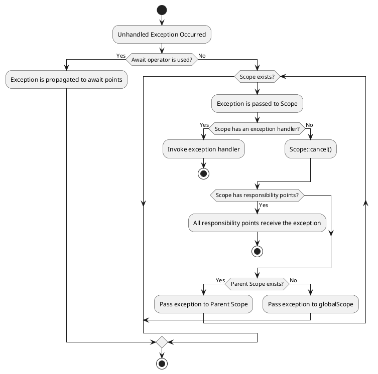
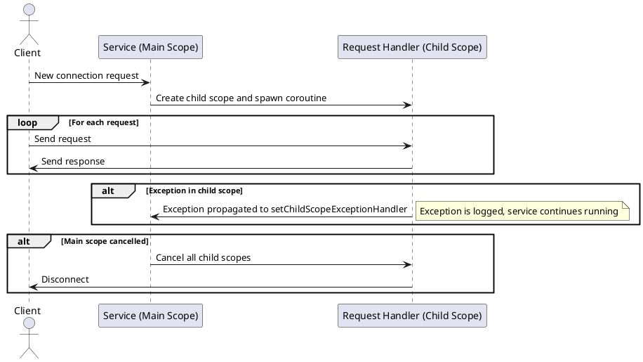

# PHP True Async

* Version: 0.9
* Date: 2025-03-01
* Author: Edmond [HT], edmondifthen@proton.me
* Status: Draft
* First Published at: http://wiki.php.net/rfc/true_async

## Proposal

### Scheduler and Reactor

The **Scheduler** and **Reactor** components should be described in a separate **RFC**, 
which should focus on the low-level implementation in **C** and define **API** contracts for PHP extensions. 
These components should be developed as extensions that may be included 
in the PHP standard library but can also be replaced with custom implementations.

The **Scheduler** is a component responsible for managing the execution order of coroutines.  

> ⚠️ **Warning:** Users should not make assumptions about the execution order of coroutines unless 
> this is a specific goal of a particular **Scheduler** implementation.

The **Reactor** is a component that implements the **Event Loop**. 
It may be exposed as a separate API in **PHP-land**, 
but its behavior is not defined within this **RFC**.

> ⚠️ **Notice:** The logic of **Scheduler** and **Reactor** **MUST NOT** contradict the logic of this RFC!
> These components **MUST** implement the contracts defined in this document. 
> The **Scheduler** and **Reactor** **MAY** extend the behavior of this **RFC** by providing additional functionalities.

### Possible Syntax

In this **RFC**, you can see a potential new syntax for describing concurrency.  
This syntax is **NOT a mandatory** part of this **RFC** and may be adopted separately.

### Limitations

This **RFC** does not implement "colored functions" 
(see: https://journal.stuffwithstuff.com/2015/02/01/what-color-is-your-function/). 
Instead, it provides **transparent concurrency**, allowing **any function** to be asynchronous.

This **RFC** does not contradict a potential multitasking implementation 
where possible but does not assume its existence.

This **RFC** assumes the ability to create coroutines in other **Threads** using the **Scheduler API** 
or separate extensions but does not describe this capability.

This **RFC** also assumes functionality expansion using **SharedMemory**, 
specifically designed shared memory objects, through a separate API that is not part of this **RFC**.

This *RFC* is a core part of the **PHP TRUE ASYNC** contracts 
but assumes the development and approval of the following RFCs:

- **True Async API** – a low-level API for PHP extensions
- **Scheduler/Reactor API** – additional API for managing coroutines and the event loop
- **Primitives:** `Channel`, `Future`, `Iterator`, `Interval`
- **Inter-thread communication / Shared Memory objects**

### Namespace

All functions, classes, and constants defined in this **RFC** are located in the `Async` namespace.
Extensions for **Scheduler/Reactor** are allowed to extend this namespace with functions and classes, 
provided that they are directly related to concurrency functionality.

### Coroutine

A `Coroutine` is an `execution container`, transparent to the code, 
that can be suspended on demand and resumed at any time.

Any function can be executed as a coroutine without any changes to the code.

```php
function example(string $name): void {
    echo "Hello, $name!";
}

spawn(example(...), 'World');

// With special syntax

spawn example('World');

// Or the same with a closure

$name = 'World';

spawn function use($name): void {
    echo "Hello, $name!";
};

// We can run as coroutine any valid function.
spawn file_get_contents('file1.txt');
spawn sleep(1);
spawn strlen('Hello, World!');

```

The `spawn` function execute the `example` function in an asynchronous context.

```php

$coroutine = spawn(function(string $name): void {
    echo "Hello, $name!";
}, 'World');

```

The `spawn` function returns a `Coroutine` object 
that can be used to control the execution of the coroutine:

```php

$coroutine = spawn(function(string $name): void {
    echo "Hello, $name!";
}, 'World');

$coroutine->cancel();
```

### Suspension

A coroutine can suspend itself at any time using the `suspend` function:

```php
function example(string $name): void {
    echo "Hello, $name!";
    suspend();
    echo "Goodbye, $name!";
}

spawn example('World');
spawn example('Universe');
```

Expected output:

```
Hello, World!
Hello, Universe!
Goodbye, World!
Goodbye, Universe!
```

The `suspend` function can be used only for the current coroutine.

The `suspend` function has no parameters and does not return any values, 
unlike the yield operator.

The `suspend` function can be used in any function and in any place
including from the main execution flow:

```php
function example(string $name): void {
    echo "Hello, $name!";
    suspend();
    echo "Goodbye, $name!";
}

$coroutine = spawn example('World');

// suspend the main flow
suspend();

echo "Back to the main flow";

```

Expected output:

```
Hello, World!
Back to the main flow
Goodbye, World!
```

The suspend operator can be a throw point 
if someone resumes the coroutine externally with an exception.

```php

function example(string $name): void {
    echo "Hello, $name!";
    
    try {
        suspend();
    } catch (Exception $e) {
        echo "Caught exception: ", $e->getMessage();
    }
        
    echo "Goodbye, $name!";
}

$coroutine = spawn example('World');

// pass control to the coroutine
suspend();

$couroutine->cancel();
```

Expected output:

```
Hello, World!
Caught exception: cancelled at ...
Goodbye, World!
```

### Input/Output Operations And Implicit Suspension

I/O operations invoked within the coroutine's context transfer control implicitly:

```php
spawn function:void {
    echo "Start reading file1.txt\n";
    file_get_contents('file1.txt');
    echo "End reading file1.txt\n";
}
spawn function:void {
    echo "Start reading file2.txt\n";
    file_get_contents('file2.txt');
    echo "End readingfile2.txt\n";  
}

echo "Main flow";
```

Expected output:

```
Start reading file1.txt
Start reading file2.txt
Main flow
End reading file1.txt
End reading file2.txt
```

Inside each coroutine, 
there is an illusion that all actions are executed sequentially, 
while in reality, operations occur asynchronously.

### Await

The `await` function/operator is used to wait for the completion of another coroutine:

```php

spawn function {
    echo "Start reading file1.txt\n";
    
    $result = await spawn function:string {
        return file_get_contents('file1.txt');    
    };
            
    echo "End reading file1.txt\n";
};

spawn function {
    echo "Sleep\n";
    sleep(1);    
};
```

`await` suspends the execution of the current coroutine until 
the awaited one returns a final result or completes with an exception.

### Lifetime limitation

    The lifecycle of a coroutine is the time limit within which the coroutine is allowed to execute.

When using coroutines, three models of responsibility distribution regarding lifecycle arise:

* **No limitation**. Coroutines are not limited in their lifetime and run as long as needed.
* **Top-down limitation**: Parent coroutines limit the lifetime of their children
* **Bottom-up limitation**: Child coroutines extend the execution time of their parents

These models do not contradict each other and can be implemented in a language in combination. 
Typically, one of these models is used by default, while the other two require explicit specification.

For example, in Go, the unrestricted model applies. 
Coroutines are independent of each other, 
and if such a dependency needs to be established, the programmer must specify it explicitly.

In languages like `Kotlin` and `Swift`, 
the Bottom-up constraint is used by default and serves as a way to implement structured concurrency.

In other languages, the `Actor` model assumes that the parent's lifetime restricts the lifetime of child Actors.

| Aspect                     | No Limitation                                                                               | Bottom-up                                                                   | Top-down                                                          |
|----------------------------|---------------------------------------------------------------------------------------------|-----------------------------------------------------------------------------|-------------------------------------------------------------------|
| Execution Limit            | No lifetime restriction; coroutines run independently                                       | Parent coroutine waits until all child coroutines complete                  | Child coroutines cannot outlive their parent.                     |
| Resource Management        | Manual; programmer explicitly manages resources                                             | Automatic; resources held until child coroutines finish                     | Automatic; parent controls resources and cancellation             |
| Completion Guarantee       | No guarantee; programmer manually ensures coroutine completion                              | Guarantees completion of all child coroutines                               | Ensures that no child coroutine runs longer than the parent       |
| Nested Coroutines          | Independent; nested coroutines may run unnoticed                                            | Structured; nested coroutines explicitly affect parent's lifetime           | Hierarchical; children cannot outlive parents                     |
| Simplicity                 | Simple but requires careful manual synchronization                                          | Clear structure, prevents accidental misuse                                 | Easier to enforce controlled execution                            |
| **Risk of Resource Leaks** | Higher; leaks can include hanging coroutines and owned scopes; leaks may reach global scope | Lower*; structured concurrency reduces leaks, parent ensures proper cleanup | Low: parent always has control over lifetime                      |
| **Exception Propagation**  | Exceptions may escape to global scope and remain unhandled                                  | Exceptions propagate strictly along coroutine hierarchy                     | Exceptions are caught and handled within the parent scope         |
| **Deadlocks**              | Lower: since coroutines are independent                                                     | Higher: Accidental use of an incorrect external dependency                  | Lower: Parent dictates child lifecycle, reducing accidental locks |
| Explicitness               | Programmer explicitly defines synchronization                                               | Behavior inherently defined by model rules                                  | Cancellation is explicit; parent enforces lifecycle               |
| Semantic Complexity        | Minimal; fewer semantic constructs needed                                                   | May require additional semantic constructs for convenience                  | Slightly higher; requires explicit management of cancellations    |
| Use cases                  |                                                                                             | Useful for ensuring all subtasks complete before proceeding                 | Useful for managing complex task hierarchies                      |

Let's take a closer look at the differences between the models, their advantages and disadvantages, and use cases.

#### No Limitation

The main drawback of the **No Limitation** model is the need for manual resource management. 
However, this can also be considered an advantage, as it provides maximum control.

#### Bottom-up

The **Bottom-up** model leads to more ambiguous consequences. 
Intuitively, it seems that this model should prevent resource leaks, 
as it keeps parent coroutines alive, thereby preserving the code that awaits them. 
As a result, the code executed after waiting is more likely to clean up resources correctly.

One could say that the **Bottom-up model** makes concurrent programming less concurrent. 
However, this advantage easily turns into a disadvantage because **Bottom-up** potentially retains more
resources in memory than any other model. 
If a programmer spawns five tasks within a hierarchy, all five tasks will be retained in memory 
until their shared execution flow completes. But what if that never happens?

The situation becomes even worse if the **Bottom-up** strategy is always used by default. 
When different programmers write coroutine hierarchy code across various projects and libraries, 
it can lead to complex, hard-to-detect bugs. 
This happens because different teams may make different assumptions, 
unaware of how exactly their code might be used at higher or lower levels of the hierarchy. 
All of this makes the Bottom-up model more dangerous than useful in team-based development.

However, the **Bottom-up** model has an advantage in another scenario — 
when a parent coroutine spawns child coroutines whose completion is critically important.

Let's examine this case:

```php
function task(): void 
{
    spawn importantTask();
    
    spawn function {
        sleep(1);
        echo "Hello, PHP!";
    }; 
}

spawn task();
```

In this example, the `importantTask` coroutine is critical for the parent coroutine. If the parent coroutine completes 
before the child coroutine, it may abandon the execution of importantTask, leading to data loss.

This case is a positive aspect of the *Bottom-up* model and a negative aspect of the *Top-down* strategy.

However, this seems to be the only significant drawback of the **Top-down** strategy.

#### Top-down

The **Top-down** model limits the lifetime of child coroutines to the lifetime of the parent.  
It implements structured concurrency but, unlike the **Bottom-up** model,  
aims to release resources as quickly as possible.

```php
function task(): void 
{
    spawn(function() {
        sleep(10);
        echo "Hello, World!";
    });

    await spawn(function() {
        sleep(1);
        echo "Hello, PHP!";
    });    
}

spawn task();
```

In the example above, the lifetime of the parent coroutine explicitly matches 
the second child coroutine since the parent explicitly waits for its completion. 
The line of code echo `"Hello, World!"` will never execute because 
the parent will be terminated earlier.

To wait for direct descendants, the `await children` operator can be used:

```php
function task(): void 
{
    spawn(function() {
        sleep(10);
        echo "Hello, World!";
    });

    spawn(function() {
        sleep(1);
        echo "Hello, PHP!";
    });
    
    // parent lifetime is limited by direct descendants
    await children;
}

spawn task();
```

In this case, the **parent coroutine** will wait for the completion 
of the first and second child coroutines but not their descendants. 
This differs from the logic of the **Bottom-up** model, 
where all nested descendants affected the parent's lifetime.

Example:

```php
function task(): void 
{
    spawn function {
        spawn function {
            sleep(10); // <-- not affected to task lifetime
            
            echo "This code will not be executed";
        };
        
        sleep(2); // <-- affected to task lifetime
        echo "Hello, World!";
    };

    spawn function {
        sleep(1);
        echo "Hello, PHP!";
    };
    
    // parent lifetime is limited by direct descendants
    await children;
}

spawn task();
```

The `Scope` primitive allows implementing **Bottom-Up** behavior within the **Top-Down** model.  
In the following example, the parent coroutine will wait for the completion of all child coroutines at every depth level.

```php
function task(): void 
{
    $coroutineScope = new Scope();
    
    $coroutineScope->spawn(function() {    
        sleep(10);
        echo "Hello, World!";
    });

    $coroutineScope->spawn(function() {
        sleep(1);
        echo "Hello, PHP!";
    });
    
    // parent lifetime is extended to all descendants
    await $coroutineScope;
}
```

A drawback of the **Top-down** model, as well as the **Bottom-up** model,  
is the need for a special syntax to create a coroutine that will execute independently of the parent.

For example:

```php
function task(): void 
{
    globalScope()->spawn(function { // <-- create a coroutine in the global scope
        sleep(10);
        echo "Hello, World!";
    });

    spawn function {
        sleep(1);
        echo "Hello, PHP!";
    };
    
    spawn function {
        echo "Hello, PHP2!";
    };
    
    // await only "Hello, PHP!" and "Hello, PHP2!"
    await children;
}
```

#### Use Cases

Let's briefly review typical use cases for each model:

| Use Case                                   | No Limitation                         | Bottom-up                                    | Top-down                                        |
|--------------------------------------------|---------------------------------------|----------------------------------------------|-------------------------------------------------|
| Asynchronous tasks in UI                   | ± Allows independent execution        | - May delay UI responsiveness                | - May prematurely interrupt child tasks         |
| Data processing where tasks spawn subtasks | - Requires manual synchronization     | + Ensures subtasks finish before parent      | - Risk of losing subtasks and data              |
| **Long-running background tasks**          | + Suitable for independent execution  | + Guarantees complete execution              | - Risks premature cancellation                  |
| **Server request handling**                | - Risk of resource leaks              | - Can lead to high memory consumption        | + Ensures resource cleanup                      |
| Parallel execution of independent tasks    | + Best for unrelated concurrent tasks | - Additional structure required              | - Poor; risks unwanted task cancellations       |
| **Hierarchical task management**           | - No built-in hierarchy               | + Ensures the execution of child coroutines. | + Strongly hierarchical, controlled             |
| Actor-based concurrency                    | - Requires manual management          | - Actors may unintentionally block parent    | + Ideal for actor-based concurrency             |


To make a choice in favor of a particular model, we should consider the nature of **PHP** as a language  
designed for business logic, tolerant to errors, easy to use, and focused on BackEnd applications.

Note that the **Top-down** model is best suited for frameworks because it allows **restricting**  
user code that is invoked lower in the hierarchy.

At the same time, **Top-down** will complicate the code of libraries or framework components  
that are invoked lower in the hierarchy if they need to modify coroutine behavior.

Such overhead is acceptable since frameworks and libraries typically take on **more** responsibility,  
implementing specific patterns or algorithms while hiding complexity behind contracts for the user.

The **primary argument** for choosing the **Top-down** model is that it forces the programmer to extend 
the lifetime of coroutines when necessary, rather than restricting them as in the Bottom-up model, 
which leads to resource minimization.

### Structured concurrency

Structural concurrency helps a programmer bind execution using code blocks organized in a hierarchy.  
Programming languages use two approaches:
* Coroutine functions themselves are structural elements.
* Additional syntactic blocks can complement control.

When making a choice within PHP, we will follow the rule of minimizing syntax.

This is why coroutine functions will be the primary and only syntactic blocks for structural concurrency, 
but not the only semantic tools.  
The order of coroutine execution forms a hierarchy that follows the rules of the Top-down strategy:

```php
function subsubtask(): void 
{
    sleep(1);
    echo "Subsubtask\n";
}

function subtask(): void 
{
    echo "Subtask\n";
    await spawn subsubtask();
}

function task(): void 
{
    await spawn subtask();    
}

spawn task();
```

Hierarchy of calls:

```plaintext
GLOBAL
└── task()
    └── subtask()
        └── subsubtask()
```

Execution flow:
1. `task()` is spawned.
2. `subtask()` is spawned and awaited.
    - Prints: **"Subtask"**
3. `subsubtask()` is spawned and awaited inside `subtask()`.
    - Sleeps for 1 second.
    - Prints: **"Subsubtask"**

The lifetime of child coroutines cannot exceed the lifetime of their parent.  
In the example above, parents explicitly await the execution of child coroutines,  
so the total lifetime of `task` equals the execution time of `subsubtask`.

```php
function mainTask(): void 
{
    // watcher pattern
    spawn function {
        while (true) {
            sleep(2);
            echo "Cleanup: removing dead connections...\n";
        }
    };

   while(...) {       
       echo "Worker: processing connection $i...\n";
       ...
       suspend();
   }
}

spawn mainTask();
```

The example above demonstrates the **Watcher** pattern.  
The `mainTask` function creates a child coroutine **Watcher**, 
which periodically cleans up resources in an infinite loop, while `mainTask` performs useful work.  
The **Watcher** will be terminated as soon as the task completes its work.

### Coroutine Scope

In **structural concurrency**, a **Scope** is a mechanism that ensures coroutines are properly managed 
within a defined execution context. 
It provides control over **lifetime, cancellation, and completion** of coroutines.

Child coroutines inherit the parent's Scope:

```php
use Async\Scope;

function task(): void 
{
    $scope = new Scope();
    $scope->set('connections', 0);
    
    $scope->spawn(function() {
        sleep(1);
        echo currentScope()->get('connections')."\n";
    });
    
    $scope->spawn(function() {
        sleep(2);
        echo currentScope()->get('connections')."\n";
    });
    
    await $scope;
}

spawn task();
```

The `Scope` primitive can be used in an `await` expression, 
in which case the code will pause until all child tasks are completed.

#### Coroutine Scope waiting

The `await` operator can be used with a `Scope` object:

```php
function task(): void 
{
    $scope = new Scope();
    
    $scope->spawn(function() {
        spawn function {
            sleep(1);
            echo "Task 1-1\n";
        };
        
        sleep(1);
        echo "Task 1\n";
    });
    
    $scope->spawn(function() {
        sleep(2);
        echo "Task 2\n";
    });
    
    // wait for all child coroutines
    await $scope;
}

spawn task();
```

If you need to wait only for direct descendants, use the method `awaitDirectChildren`: 

```php
$scope = new Scope();
// create child coroutines        
$scope->awaitDirectChildren();
```

#### Scope cancellation

The `cancel` method cancels all child coroutines:

```php
$scope = new Scope();
$scope->spawn(function() {
    sleep(1);
    echo "Task 1\n";
});

$scope->spawn(function() {
    sleep(2);
    echo "Task 2\n";
});

$scope->cancel();
```

#### BoundedScope

The `BoundedScope` class is designed to create explicit constraints 
that will be applied to all coroutines spawned within the specified Scope.

| Method                                 | Description                                                                                             |
|----------------------------------------|---------------------------------------------------------------------------------------------------------|
| `withTimeout(int $milliseconds)`       | Creates a new scope with a specified timeout, automatically canceling coroutines when the time expires. |
| `spawnAndBound(callable $coroutine)`   | Spawns a coroutine and restricts the lifetime of the entire Scope to match the coroutine’s lifetime.    |
| `boundedBy(mixed $constraint)`         | Limits the scope’s lifetime based on a **Cancellation token, Future, or another coroutine's lifetime**. |

```php
$scope = new BoundedScope();
$scope->withTimeout(1000);

$scope->spawnAndBound(function() {
    sleep(2);
    echo "Task 1\n";
});

await $scope;
```

#### Coroutine Scope Slots

| Method                                                                | Description                                         |
|-----------------------------------------------------------------------|-----------------------------------------------------|
| `find(string\|object $key): mixed`                                    | Find a value by key in the current or parent Scope. |
| `get(string\|object $key): mixed`                                     | Get a value by key in the current Scope.            |
| `has(string\|object $key): bool`                                      | Check if a key exists in the current Scope.         |
| `findLocal(string\|object $key): mixed`                               | Find a value by key only in the local Scope.        |
| `getLocal(string\|object $key): mixed`                                | Get a value by key only in the local Scope.         |
| `hasLocal(string\|object $key): bool`                                 | Check if a key exists in the local Scope.           |
| `set(string\|object $key, mixed $value, bool $replace = false): self` | Set a value by key in the Scope.                    |
| `unset(string\|object $key): self`                                    | Delete a value by key from the Scope.               |


The `Scope` class provides a mechanism 
for storing data that is accessible to all child coroutines.

```php
$scope = new Scope();
$scope->set('connections', 0);

$scope->spawn(function() {
    sleep(1);
    echo currentScope()->get('connections')."\n";
});

$scope->spawn(function() {
    sleep(2);
    echo currentScope()->get('connections')."\n";
});

await $scope;
```

**Coroutine Scope Slots** are an efficient mechanism for managing memory 
associated with coroutine lifetimes.  
Once all coroutines owning the Scope complete, 
or the Scope itself is terminated, all data in the slots will be released.

This helps the programmer associate data with coroutines without writing explicit cleanup code.

To ensure data encapsulation between different components, 
**Coroutine Scope Slots** provide the ability to associate data using **key objects**.  
An object instance is unique across the entire application, 
so code that does not have access to the object cannot read the data associated with it.

This pattern is used in many programming languages and is represented in JavaScript by a special class, **Symbol**.

```php
$key = new Async\Key('pdo connection');

if(currentScope()->has($key)) {
    $pdo = currentScope()->get($key);
} else {
    $pdo = new PDO('sqlite::memory:');
    currentScope()->set($key, new PDO('sqlite::memory:'));
}
```

**Coroutine Scope Slots** can automatically dereference **WeakReference**.  
If you assign a **WeakReference** to a slot and then call `find()`, 
you will receive the original object or `NULL`.

```php
function task(): void 
{
    // Should return the original object
    $pdo = currentScope()->find('pdo');
}

$pdo = new PDO('sqlite::memory:');
currentScope()->set('pdo', new WeakReference($pdo));

spawn task();
```

#### Coroutine Scope Inheritance

Scope primitives, like coroutines, can be structured into a hierarchy. 
To create a Scope object that inherits from another, use the static method `inherit()`.

```php
$parentScope = new Scope();
$parentScope->set('connections', 0);
$parentScope->set('pdo', new PDO('sqlite::memory:'));
$childScope = Scope::inherit($parentScope);
$childScope->set('connections', 1);

$childScope->spawn(function() {
    echo "Child\n";
    echo currentScope()->get('connections')."\n";
});

$parentScope->spawn(function() {
    echo "Parent\n";
    echo currentScope()->get('connections')."\n";
});

await $parentScope;
```

A child `Scope` overrides the parent's memory slots. 
If a slot with the same key is defined in the child `Scope`, 
the `get` method will return the value from the child slot; 
otherwise, it will return the value from the parent.

Waiting for a parent Scope extends to waiting for all child Scopes in the hierarchy.

The restrictions of a parent `Scope` do not directly apply to child `Scope` instances. 
However, the lifetime of child `Scope` instances cannot exceed that of the parent. 
Therefore, if the parent is completed or canceled, the same will happen to all child `Scope` instances.


```php
$parentScope = new BoundScope();
$parentScope->withTimeout(1000);
$childScope = Scope::inherit($parentScope);

$childScope->spawn(function() {
    sleep(2);
    echo "This code will not be executed";
});

await $parentScope;
```

#### Coroutine Scope Lifetime

The lifetime of a `Scope` is determined by the lifetime of the PHP object `$scope`. 
The lifetime of coroutines belonging to a `Scope` is restricted by the lifetime of that `Scope`. 
This rule allows the creation of coroutine groups that can be tied to the lifetime of a service.

Let's consider an example:

```php
final class SocketPoll
{
    private $serverSocket;
    private Scope $scope;

    public function __construct(string $host, int $port)
    {
        $this->serverSocket = stream_socket_server("tcp://$host:$port", $errno, $errstr);
        
        if (!$this->serverSocket) {
            throw new RuntimeException("Failed to create server socket: $errstr ($errno)");
        }
        
        $this->scope = new Scope();
    }
    
    public function __destruct()
    {
        $this->stop();
    }

    public function start(): void
    {
        $this->scope->spawn(function () {
           try {
              while (($clientSocket = stream_socket_accept($this->serverSocket, 0)) !== null) {
                  $this->scope->spawn($this->handleConnection(...), $clientSocket);
              }           
           } finally {
               fclose($this->serverSocket);
           }
        });   
    }

    private function handleConnection($clientSocket): void
    {
         try {
             fwrite($clientSocket, "Hello! You're connected.\n");
         
             while (!feof($clientSocket)) {
                 $data = fread($clientSocket, 1024);
                 if ($data === false || $data === '') {
                     break;
                 }
                 
                 fwrite($clientSocket, "Received: $data");
             }
         } finally {
             fclose($clientSocket);
         }         
    }

    public function stop(): void
    {
        fclose($this->serverSocket);
        $this->scope->cancel();
    }
}
```

The `SocketPoll` service creates a separate private `Scope` for all the coroutines it starts.  
This allows it to easily cancel the connection handling process, 
which will terminate both the coroutine waiting for new connections and all coroutines processing them.

   **Note:** 
   This example contains a circular dependency between objects, which should be avoided in real-world development.

Coroutines belonging to a `Scope` do not increase its reference count.  
This rule has several important consequences:

```php
function test(): void
{
    $scope = new Scope();
    
    $scope->spawn(function() {
        sleep(1);
    });
    
    $scope->spawn(function() {
        sleep(2);        
    });
    
    // No coroutine will ever be started.
    unset($scope);
}

spawn test();
```

#### Coroutine local context

While a `Scope` can serve as a shared context in the coroutine hierarchy, 
a coroutine's **local context** is a personal data store strictly tied to the coroutine's lifetime. 
The local context allows associating data slots that are automatically freed once the coroutine completes.

The local coroutine context is accessible via the `Async\localContext()` function, 
which returns an `Async\Context` object. 
The `Async\Context` class provides the same methods for working with slots as the `Scope` class:

```php
function task(): void 
{
    localContext()->set('data', 'This local data');
    
    spawn function {
         // No data will be found
         echo localContext()->find('data')."\n";
    };
}
```

Using a coroutine's local context can be useful for associating objects with a coroutine that **MUST** be unique to each coroutine.  
For example, a database connection.

```php
<?php

namespace Async;

use PDO;
use RuntimeException;

class ConnectionProxy
{
    private PDO $connection;

    public function __construct(PDO $connection)
    {
        $this->connection = $connection;
    }
    
    public function __destruct()
    {
        getGlobalConnectionPool()->releaseConnection($this->connection);
    }
}

class ConnectionPool
{
    private array $pool = [];
    private int $maxConnections = 10;

    public function getConnection(): ConnectionProxy
    {
        if (!empty($this->pool)) {
            return new ConnectionProxy(array_pop($this->pool));
        }

        if (count($this->pool) < $this->maxConnections) {
            return new ConnectionProxy(PDO("mysql:host=localhost;dbname=test", "user", "password"));
        }

        throw new RuntimeException("No available database connections.");
    }

    public function releaseConnection(PDO $connection): void
    {
        $this->pool[] = $connection;
    }
}

function getDb(): ConnectionProxy
{
    static $key = new Async\Key('db_connection');
    
    $context = Async\localContext();

    if ($context->has($key)) {
        return $context->get($key);
    }

    $pool = getGlobalConnectionPool();
    $connection = $pool->getConnection();

    $context->set($key, $connection);

    return $connection;
}

function getGlobalConnectionPool(): ConnectionPool
{
    static $pool = null;
    if ($pool === null) {
        $pool = new ConnectionPool();
    }
    return $pool;
}

function printUser(int $id): void 
{
    $db = getDb();
    $stmt = $db->query("SELECT * FROM users WHERE id = $id");
    $users = $stmt->fetchAll(PDO::FETCH_ASSOC);
    print_r($users);
}

spawn printUser(1);
spawn printUser(2);
```

This code relies on the fact that an instance of the `ConnectionProxy` 
class will be destroyed as soon as the coroutine completes.  
The destructor will be called, and the connection will automatically return to the pool.

### Error Handling

An uncaught exception in a coroutine follows this flow:

1. If the coroutine is awaited using the `await` operator, 
the exception is propagated to the awaiting points. 
If multiple points are awaiting, each will receive the exception.
2. The exception is passed to the `Scope`.
3. If the `Scope` has an exception handler defined, it will be invoked.
4. If the `Scope` does not have an exception handler, the `cancel()` method is called, 
canceling all coroutines in this scope from top to bottom in the hierarchy, including all child scopes.
5. If the `Scope` has responsibility points, i.e., the construction `await $scope`, 
all responsibility points receive the exception.
6. Otherwise, the exception is passed to the parent scope if it is defined.
7. If there is no parent scope, the exception falls into `globalScope`, 
where the same rules apply as for a regular scope.



If an exception reaches `globalScope` and is not handled in any way, 
it triggers **Graceful Shutdown Mode**, which will terminate the entire application.

The `BoundedScope` class allows defining an exception handler that can prevent exception propagation.

For this purpose, two methods are used:
- **`setExceptionHandler`** – triggers for any exceptions thrown within this **Scope**.
- **`setChildScopeExceptionHandler`** – triggers for exceptions from **child Scopes**.

**Example:**

```php
$scope = new BoundedScope();
$scope->setExceptionHandler(function (Async\Scope $scope, Async\Coroutine $coroutine, Throwable $e) {
    echo "Caught exception: {$e->getMessage()}\n in coroutine: {$coroutine->getSpawnLocation()}\n";
});

$scope->spawn(function() {
    throw new Exception("Task 1");
});

Async\await($scope);
```

Using these handlers, 
you can implement the **Supervisor** pattern, i.e., 
a **Scope** that will not be canceled when an exception occurs in coroutines.

The **`setChildScopeExceptionHandler`** method allows handling exceptions only from **child Scopes**, 
which can be useful for implementing an algorithm where the **main Scope** runs core tasks, 
while **child Scopes** handle additional ones.

For example:

```php
final class Service
{
    private Scope $scope;
    
    public function __construct()
    {
        $this->scope = new Scope();
        
        $this->scope->setChildScopeExceptionHandler(
        static function (Scope $scope, Coroutine $coroutine, \Throwable $exception): void {
            echo "Occurred an exception: {$exception->getMessage()} in Coroutine {$coroutine->getSpawnLocation()}\n";
        });
    }
    
    public function start(): void
    {
        $this->scope->spawn($this->run(...));
    }
    
    public function stop(): void 
    {
        $this->scope->cancel();
    }
    
    private function run(): void
    {
        while (($socket = $this->service->receive()) !== null) {
            Scope::inherit($this->scope)->spawn($this->handleRequest(...), $socket);
        }
    }
}
```

`$this->scope` listens for new connections on the server socket.  
Canceling `$this->scope` means shutting down the entire service.

Each new connection is handled in a separate **Scope**, which is inherited from `$this->scope`.  
If an exception occurs in a coroutine created within a **child Scope**, 
it will be passed to the `setChildScopeExceptionHandler` handler and will not affect 
the operation of the service as a whole.



#### Responsibility points

A **responsibility point** is code that explicitly waits for the completion of a coroutine or a `Scope`:

```php
$scope = new Scope();

$scope->spawn(function() {
  throw new Exception("Task 1");        
});

try {
    await $scope;
} catch (\Throwable $e) {
     echo "Caught exception: {$e->getMessage()}\n";
}      
```

A **responsibility point** has a chance to receive 
not only the result of the coroutine execution but also an unhandled exception.

#### Exception Handling

The `BoundedScope` class provides a method for handling exceptions:

```php
$scope = new BoundedScope();

$scope->spawn(function() {
  throw new Exception("Task 1");        
});

$scope->setExceptionHandler(function (Exception $e) {
    echo "Caught exception: {$e->getMessage()}\n";
});

await $scope;
```

An exception handler has the right to suppress the exception.  
However, if the exception handler throws another exception, 
the exception propagation algorithm will continue.

#### onExit

The `onExit` method allows defining a callback function that will be invoked when a coroutine or scope completes.  
This method can be considered a direct analog of `defer` in Go.

```php
$scope = new Scope();

$scope->spawn(function() {
  throw new Exception("Task 1");        
});

$scope->onExit(function () {
    echo "Task 1 completed\n";
});

await $scope;
```

Or for coroutines:

```php
function task(): void 
{
    onExit(function () {
        echo "Task completed\n";
    });
    
    throw new Exception("Task 1");
}

spawn task();
```

The `onExit` semantics are most commonly used to release resources, 
serving as a shorter alternative to `try-finally` blocks:

```php
function task(): void 
{
    $file = fopen('file.txt', 'r');    
    onExit(fn() => fclose($file));
    
    throw new Exception("Task 1");
}

spawn task();
```

### Cancellation

The cancellation operation is available for coroutines and scopes 
using the `cancel()` method:

```php
function task(): void {}

$coroutine = spawn task();

// cancel the coroutine
$coroutine->cancel(new Async\CancellationException('Task was cancelled'));
```

The cancellation operation is implemented as follows:

1. If a coroutine has not started, it will never start.
2. If a coroutine is suspended, its execution will resume with an exception.
3. If a coroutine has already completed, nothing happens.

The `CancellationException`, if unhandled within a coroutine, is automatically suppressed after the coroutine completes.

> ⚠️ **Warning:** You should not attempt to suppress `CancellationException` exception, 
> as it may cause application malfunctions.

```php
$scope = new Scope();

$scope->spawn(function() {
    sleep(1);        
    echo "Task 1\n";
});

$scope->cancel(new Async\CancellationException('Task was cancelled'));
```

Canceling a `Scope` triggers the cancellation of all coroutines 
within that `Scope` and all child `Scopes` in hierarchical order.

#### CancellationException propagation

The `CancellationException` affects PHP standard library functions differently. 
If it is thrown inside one of these functions that previously did not throw exceptions, 
the PHP function will terminate with an error.

In other words, the `cancel()` mechanism does not alter the existing function contract. 
PHP standard library functions behave as if the operation had failed.

Additionally, the `CancellationException` will not appear in `get_last_error()`, 
but it may trigger an `E_WARNING` to maintain compatibility with expected behavior 
for functions like `fwrite` (if such behavior is specified in the documentation).

#### exit and die operators

The `exit`/`die` operators called within a coroutine result in the immediate termination of the application.  
Unlike the `cancel()` operation, they do not allow for proper resource cleanup.

### Graceful Shutdown

When an **unhandled exception** occurs in a **Coroutine**
the **Graceful Shutdown** mode is initiated. 
Its goal is to safely terminate the application.

**Graceful Shutdown** cancels all coroutines in `globalScope`, 
then continues execution without restrictions, allowing the application to shut down naturally.  
**Graceful Shutdown** does not prevent the creation of new coroutines or close connection descriptors. 
However, if another unhandled exception is thrown during the **Graceful Shutdown** process, 
the second phase is triggered.

**Second Phase of Graceful Shutdown**
- All **Event Loop descriptors** are closed.
- All **timers** are destroyed.
- Any remaining coroutines that were not yet canceled will be **forcibly canceled**.

The further shutdown logic may depend on the specific implementation of the **Scheduler** component, 
which can be an external system and is beyond the scope of this **RFC**.

The **Graceful Shutdown** mode can also be triggered using the function:

```php
Async\gracefulShutdown(\Throwable|null $throwable = null): void {}
```

from anywhere in the application.

### Deadlocks

A situation may arise where there are no active **Coroutines** in the execution queue 
and no active handlers in the event loop. 
This condition is called a **Deadlock**, and it represents a serious logical error.

When a **Deadlock** is detected, the application enters **Graceful Shutdown** mode 
and generates warnings containing information about which **Coroutines** are in a waiting state 
and the exact lines of code where they were suspended.

### Tools

The `Coroutine` class implements methods for inspecting the state of a coroutine.

| Method                                 | Description                                                                                                                                                                                            |
|----------------------------------------|--------------------------------------------------------------------------------------------------------------------------------------------------------------------------------------------------------|
| **`getSpawnFileAndLine():array`**      | Returns an array of two elements: the file name and the line number where the coroutine was spawned.                                                                                                   |
| **`getSpawnLocation():string`**        | Returns a string representation of the location where the coroutine was spawned, typically in the format `"file:line"`.                                                                                |
| **`getSuspendFileAndLine():array`**    | Returns an array of two elements: the file name and the line number where the coroutine was last suspended. If the coroutine has not been suspended, it may return `['',0]`.                           |
| **`getSuspendLocation():string`**      | Returns a string representation of the location where the coroutine was last suspended, typically in the format `"file:line"`. If the coroutine has not been suspended, it may return an empty string. |
| **`isSuspended():bool`**               | Returns `true` if the coroutine has been suspended                                                                                                                                                     |
| **`isCancelled():bool`**               | Returns `true` if the coroutine has been cancelled, otherwise `false`.                                                                                                                                 |
| **`getTrace():array`**                 | Returns the stack trace of the coroutine.                                                                                                                                                              |

The `Coroutine::getAwaitingInfo()` method returns an array with debugging information 
about what the coroutine is waiting for, if it is in a waiting state.

The format of this array depends on the implementation of the **Scheduler** and the **Reactor**.

The `Async\getCoroutines()` method returns an array of all coroutines in the application.

### Prototypes

* [Async functions](./examples/Async/Async.php)
* [Coroutine](./examples/Async/Coroutine.php)
* [Coroutine Context](./examples/Async/Context.php)
* [Coroutine Scope](./examples/Async/Scope.php)
* [Coroutine BoundedScope](./examples/Async/BoundedScope.php)
* [Coroutine Key](./examples/Async/Key.php)

## Backward Incompatible Changes

Simultaneous use of the **True Async API** and the **Fiber API** is not possible.

- If `new Fiber()` is called first, the `Async\spawn` function will fail with an error.
- If `Async\spawn` is called first, any attempt to create a **Fiber** will result in an error.

## Proposed PHP Version(s)

PHP 8.6/ PHP 9.0